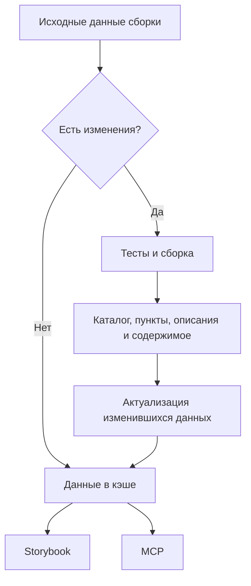

# Сборка и кэширование данных сценариев

Каталог вариантов, пункты, их описания и содержимое собираются из выполняемых
тестов во время сборки Storybook. Собранные данные сохраняются в кэше
и используются интерфейсом и MCP. Открытие пункта показывает подготовленные данные.

Если исходные данные сборки не изменились, используется кэшированный результат.
При изменениях выполняются тесты и сборка; после выполнения тестов полученные
данные актуализируются, если их содержимое изменилось.

Это согласованный цикл подготовки данных. Формат хранения и интеграцию
со сборкой ещё предстоит детализировать; схема не подтверждает готовность реализации.

Выбор варианта серверной функции в App дополнительно выполняет новый тест с его
props. Эти запуски не используют исходы из кэша и не изменяют отчёт сборки.
Их жизненный цикл описан в [представлении результатов функции](../../notes/function-results.md).

Технический отчёт и его представление описаны у
[читателя App](../README.md). Archetypes использует готовые данные для
[руководства по написанию](../../../archetypes/specs/scenarios/README.md).
