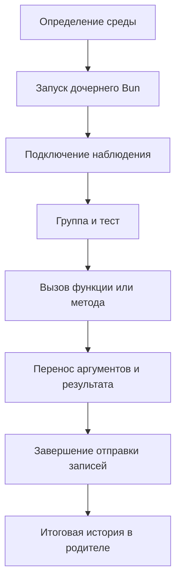

# Как собирается история вызовов

readScenario сначала читает структуру исходника, затем определяет среду
и запускает дочерний Bun.
В дочернем процессе он связывает вызовы с группами и тестами и передаёт записи
родителю. После завершающего отчёта readScenario применяет правила к структуре
и выполнению, возвращая единый результат с валидацией.

## Структура и валидация

- [read-source.ts](../src/read-source.ts) читает структуру, исходные фрагменты и координаты объявлений.
- [preview.ts](../src/preview.ts) статически связывает общую fixture с вызовом
  `render`, а после выполнения подставляет только переносимые props фактического варианта.
- [function-preview.ts](../src/function-preview.ts) соединяет фактические вызовы
  функции с вариантами и сохраняет подтверждённые импорты из таблицы как ссылки
  в исходнике, не пытаясь переносить их исполняемое содержимое через JSON.
- [validateScenario](../../../archetypes/specs/scenarios/validation/index.ts) применяет правила Archetypes и обозначает незавершённые проверки.
- [index.ts](../../../archetypes/specs/scenarios/index.ts) объединяет структуру, один запуск и валидацию в публичный результат.

## Подготовка и запуск

- [discover.ts](../src/discover.ts) находит пакет и собирает конфигурацию запуска.
- [imports.ts](../src/imports.ts) разбирает и разрешает статические импорты исполняемого кода.
- [preloads.ts](../src/preloads.ts) читает подготовку среды из конфигурации пакета.
- [jsx-runtime.ts](../src/jsx-runtime.ts) определяет JSX transport по exports владельца preload.
- [trace.ts](../src/trace.ts) запускает процесс, принимает записи и возвращает результат.
  Конфигурация и необязательные props передаются через stdin до загрузки сценария.

## Наблюдение в дочернем процессе

- [trace-preload.ts](../src/trace-preload.ts) подключает части сборщика.
- [instrument.ts](../src/instrument.ts) добавляет контекст в callback bodies через TypeScript AST.
- [context.ts](../src/context.ts) хранит варианты групп и асинхронный контекст тестов.
  Для внешнего describe.each он создаёт строки с переданными props до регистрации
  в Bun; исходные таблицы и вложенные параметризации не изменяются.
- Нативная регистрация выполняется в исходном контексте Bun, отдельно от
  добавленного контекста наблюдения. Аргументы вычисляются в исходной позиции;
  пользовательские callbacks возвращаются в свой контекст выполнения.
- [observe.ts](../src/observe.ts) записывает аргументы, исходы и порядок завершения вызовов.
- [serialize.ts](../src/serialize.ts) переносит значения без вызова getters.
- [call-location.ts](../src/call-location.ts) находит внешний frame вызова.
- [pending.ts](../src/pending.ts) ожидает завершения отправок перед итоговым IPC report.
- [records.ts](../src/records.ts) сохраняет группы и пункты с устойчивой принадлежностью внутри запуска.
- [assertions.ts](../src/assertions.ts) наблюдает native matchers, сохраняя данные и отдельные исходы.
- [report.ts](../src/report.ts) сопоставляет пункты со штатным JUnit без повторного запуска.
- [source-location.ts](../src/source-location.ts) убирает смещение колонок, внесённое инструментацией.
