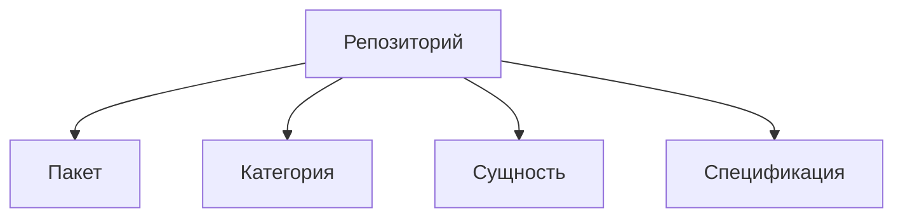

# Структура репозитория

## Развитие структуры

При расширении функциональности структура меняется так, чтобы выражать
принадлежность и отношения сущностей.

### Объединение в категорию

Когда рядом с сущностью появляются другие сущности с родственной
функциональностью, их объединяют в категорию. Исходная сущность остаётся
сущностью. Категория выражает общий признак равноправных сущностей.

### Преобразование в пакет

Сущность имеет один основной экспорт. Когда развитие её внутренней
функциональности требует нескольких самостоятельных экспортируемых сущностей,
исходная сущность становится пакетом. Каждый такой экспорт оформляется
отдельной сущностью внутри этого пакета.
Пакет выражает принадлежность этих сущностей одному целому и владеет их составом.

Пока части служат внутренней реализации одной сущности, они остаются её
исходным кодом. Основание для перехода — потребность в нескольких самостоятельных
экспортах, а не количество файлов или глубина директорий.

### Вложенность и непосредственная принадлежность

Вложенность выражает непосредственную принадлежность: внутренние элементы
размещаются у того владельца, частью которого они являются. Каждый уровень
структуры должен отражать такое отношение, а не только тематическую близость.

Если один элемент применим в нескольких видах сущностей, его общее определение
не вкладывается в один из этих видов и не дублируется в каждом. Оно размещается
на общем уровне, сохраняя собственный состав. Место определения элемента
и места его применения — разные отношения.

В Archetypes пакет `specs` владеет определениями составляющих спецификации:
зависимости, контракта, сценария и фикстуры. Сама спецификация применима
к пакету, категории и сущности, поэтому `specs` расположен рядом с их
определениями. Конкретная служебная директория `spec` при этом принадлежит
тому пакету, категории или сущности, которые она описывает и проверяет.

Глубина структуры следует из цепочки непосредственной принадлежности.
Возможность применения элемента сама по себе не добавляет уровень вложенности.

### Спецификации и тесты реализации

У пакетов и сущностей могут быть две отдельные директории проверок:

- `spec` содержит спецификации данных и ожидаемого результата.
  Положительные сценарии используются Storybook для проверки этого результата.
- `test` содержит проверки внутренних механизмов реализации, в том числе
  интеграционные тесты работы с процессами, файловой системой и отладчиком.

Тест принадлежит тому пакету или сущности, чей механизм он проверяет.
Файлы в `test` называются по проверяемому механизму или поведению и используют
суффикс `.test.ts` или `.test.tsx`, например `inspector-environment.test.ts`.
Подготовка ресурсов и их освобождение выполняются через штатные хуки Bun Test.
