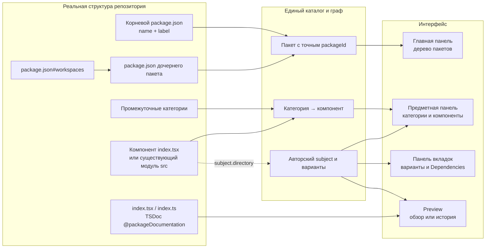

# Структура проектов, пакетов и компонентов

Пакет `@storybook/archetypes` (Archetypes) содержит единые требования к структуре
визуальных и невизуальных проектов. Этот README — единственный нормативный
источник правил пакетов, директорий, сущностей, документации, контрактов,
структурных зависимостей и сценариев. Перед созданием или изменением структуры
автор и агент читают соответствующий раздел здесь.

## Содержание

- [Идентичность и состав пакетов](#structure-contract)
- [Документация README и TSDoc](#documentation-standard)
- [Директории, сущности и публичные экспорты](#component-placement)
- [Структурные зависимости](#component-dependencies)
- [Входные и выходные контракты](#contract-documentation)
- [Сценарии](#component-scenarios)
- [Схема и примеры размещения](#structure-examples)

<a id="structure-contract"></a>

## Единые правила структуры проектов, пакетов и компонентов

Правила охватывают выбор проектов, идентичность и состав пакетов, каталоги,
компоненты и их документацию. Корневые README, ARCHITECTURE, requirements
и self-docs ссылаются на этот документ и не создают отдельные версии этих норм.
Маршруты Dependencies и вкладок определены в [контракте Панели вкладок](../requirements.md#tabs-routes),
формат ожидаемого состава — в [контракте структурных зависимостей](#component-dependencies).

### `STORYBOOK-IDENTITY-001` — корень тоже пакет

Манифест пакета не содержит `kind`, `id` и `packageJson`; resolver, схема и
генератор согласованно отклоняют или не создают эти поля. Владелец — корень
директории `.storybook`, его `package.json` является единственным источником
имени и metadata. Этот этап не меняет прежние project/workspace форматы
композиции, `runtime`, `catalog`, stylesheets, widgets и маршруты сценариев.

Identity каждого владельца равна точному `package.json#name`, включая выбранный
корень репозитория. `label` задаёт подпись, выбранный путь — местоположение.
Имя папки и legacy manifest.id не создают альтернативную identity. Каждый
владелец имеет ровно один пакетный узел; project/repository оболочки отсутствуют.
Workspaces раскрываются рекурсивно у любого пакета, с устранением повторного
обнаружения того же источника. Разные источники одного имени отклоняются.
Состав вложенных пакетов задаётся package.json#workspaces через Bun.Glob:
точные пути, `*`, `**` и исключения `!`. Порядок шаблонов сохраняется, внутри
шаблона пути упорядочены; пересечения не создают дублей. Каталог без package.json
не становится пакетом. `node_modules`, `.git`, выход за корень и symlink-пакеты
не включаются. manifest.packages остаётся для прежней композиции без workspaces;
оба источника состава одновременно не используются.

Корневые и вложенные пакеты имеют независимые сборки, ревизии и диагностику.
Корневой README следует тому же механизму применения ревизии пакета.
История старых URL обеспечивает перенаправление к существующему пакету без
введения новых identity. Формат старых опубликованных снимков сохраняется
читаемым до их замены проверенной ревизией.

Временно недоступный сохранённый путь без читаемого package.json остаётся
записью ошибки `unavailable`, а не пакетом с выдуманным именем. Для него
не создаётся PackageSession. Уже известные пакеты сохраняют последнюю
проверенную identity и независимые рабочие ревизии при ошибках родителя.

### `STORYBOOK-DOCS-001` — источник обзора по виду узла

Стандартный корневой README не дублируется полем `manifest.readme`;
генератор также не создаёт эту ссылку. Явный `readme` остаётся только для
нестандартного обзора. Пакеты без дополнительных деклараций обнаруживаются
по `package.json` без отдельного манифеста. Удаление metadata-only манифеста
должно сохранять package identity, навигацию, README и доступные ресурсы.

Любой пакет, включая корень репозитория, содержит `README.md` рядом
с `package.json`. Содержимое принадлежит авторам пакета и оформляется по
[единому стандарту документации](#documentation-standard).
Этот файл обнаруживается по структуре независимо от наличия манифеста.
Явно заданный `manifest.readme` сохраняет приоритет. Отсутствующий обзор
не скрывает узел; появление и удаление стандартного README отслеживаются.
Обычная директория использует исключительно модульный TSDoc `index.tsx` или `index.ts`.
Обзор входит в ревизию своего пакета и обновляется в пользовательских вкладках
после применения; изменение обзора родителя не перестраивает дочерние пакеты.

<a id="documentation-standard"></a>

### `STORYBOOK-DOCS-002` — содержание README и TSDoc

Этот раздел владеет общими правилами документации проектов, пакетов и предметов,
показываемых в Storybook. Он адаптирует стандарт MetaFor к существующим владельцам
Storybook. README, навыки и примеры ссылаются на него, не создавая копий норм.
Правила обнаружения обзоров, структуры, контрактов и применения ревизий сохраняют
своих владельцев. Наличие документа не доказывает соответствие его содержания
стандарту: discovery не выполняет смысловую приёмку текста.

#### Владельцы информации

Документация образует связанную систему: каждый общий факт имеет одного владельца.
Корневой документ описывает смысл системы, пользовательскую картину, жизненный
цикл, границы и карту ответственности. README пакета описывает назначение,
собственный закон работы, поддерживаемые случаи и наблюдаемый результат пакета.
Общие законы остаются в этом README общего владельца; дочерние README
ссылаются на них по контексту. Существующая карта документов сохраняется;
введение стандарта само по себе не создаёт новую директорию документации.

Обзор обычной директории принадлежит модульному TSDoc её index по
[правилу размещения компонентов](#component-placement). Технические сведения
принадлежат TSDoc существующего кода и типов. Команды запуска, диагностики и
проверок принадлежат руководству разработки. История решений, состояние задач,
снимки, измерения и результаты прогонов остаются в Git, задачах и артефактах.
Перенос сведений сохраняет уникальную информацию и её контекстные связи.

#### Смысловой текст

README объясняет, что существует и зачем, какое событие начинает работу,
кто принимает решение, что делает владелец, какой результат наблюдается и где
начинается ответственность следующего владельца. Принятый закон описывается
через действующие понятия и допустимые действия. Текст не становится журналом
миграций или пересказом прошлых ошибок.

В README не перечисляются внутренние файлы, поля DTO, generic-параметры,
детали кэшей, служебные маркеры, URL query, точные сообщения, порты, версии
инструментов, команды, тайминги и число пройденных тестов. Эти сведения сохраняются
в TSDoc, руководстве разработки, тестах или свидетельствах задачи по ответственности.
Архитектурный документ может описывать принятый целевой закон; TSDoc описывает
только реально существующий код и его фактическое поведение.

Авторский текст пишется по-русски; точные имена кода и протоколов сохраняются.
Один термин обозначает одну сущность. Первое полное scoped-имя пакета вводит
короткое имя в том же предложении; последующие упоминания используют это имя.
Namespace обозначает множество пакетов. Ссылка включается в осмысленное
предложение и называет ответственность целевого документа, а не «здесь» или
«подробнее». Общий словарь и карта ссылок не копируются между владельцами.
При перемещении документов обновляются входящие ссылки и необходимые anchors.

#### TSDoc существующих сущностей

Все авторские именованные функции, методы, компоненты, интерфейсы и типы,
включая частные helpers, получают содержательный TSDoc рядом с объявлением.
Описание объясняет назначение и существенные связи, не пересказывает название
или видимую сигнатуру. Для каждой сущности указываются применимые сведения:
границы ответственности, инварианты, единицы и ограничения значений, жизненный
цикл, владение ресурсами, побочные эффекты, ошибки и различия сред исполнения.
Несуществующие ограничения, ошибки, defaults и будущие API не придумываются.
Связи с документами-владельцами и доказательными тестами задаются по контексту.

Блок начинается с `/**`, заканчивается `*/` и не содержит декоративных `*`
в начале строк. Описания полей находятся в одном блоке перед интерфейсом,
типом или классом через принятую конвенцию `@property`, а методы имеют свои
блоки. `@property` является JSDoc-конвенцией проекта, не стандартным тегом TSDoc.
Тег содержит имя поля и краткое назначение; продолжение идёт следующей строкой
без пустой строки, разные свойства разделяются пустой строкой. Необязательность
обозначается `[name]`, подтверждённое значение по умолчанию — `[name=value]`.

`@param`, `@typeParam`, `@returns`, `@throws` и примеры объясняют полезные сведения
своей сущности, не дублируя TypeScript-типы и очевидные defaults. Пример использует
существующий публичный API. Для параметров с общими именами вроде `data`, `config`,
`name` или `id` описание раскрывает ожидаемый формат, структуру либо допустимый
словарь. Для числовых параметров указываются фактический диапазон и поведение
за его пределами. Ошибки валидации описываются через `@throws`.

Упоминания типов, функций и других сущностей кода связываются через
`{@link SymbolName}` или точную declaration reference, ведущую к существующему
объявлению. Это правило действует и в описаниях параметров, свойств и результата.
Внешние документы и файлы связываются обычными Markdown links. Содержимое TSDoc
оформляется как Markdown: абзацы и block tags разделяются пустой строкой,
имена кода выделяются обратными кавычками, примеры — fenced block с языком.
Для продолжения `@property` сохраняется отдельное правило одного абзаца выше.

Контракт содержит только документацию своего
основного интерфейса по [правилу контрактов](#contract-documentation);
модульный обзор остаётся в index. Vendor и generated code не переписываются.
Документация читается из исходников и IDE; существующее представление TypeDoc
в Storybook использует тот же источник. Отдельный генератор, сайт документации
или копия описаний ради этого стандарта не создаются.

#### Проверка документационной правки

Перед правкой сверяются действующие документы-владельцы, код, публичные типы,
exports, тесты и существенная история. Чисто документационный diff меняет только
тексты Markdown, содержимое TSDoc или текст навыков: без исполняемых tokens,
сигнатур, manifests, runtime, build и test code. Для него достаточно чтения
полного diff, Markdown/TSDoc parsing, проверки ссылок и anchors и diff-check.
Он сам по себе не требует typecheck, тестов, сборки, смены версии, публикации
артефактов или перезапуска процессов. Смешанный diff проверяется по всем
затронутым исполняемым контрактам и не получает этого исключения.

Явная задача показать или применить обновлённую документацию в Storybook проходит
существующий MCP-процесс проверки кандидата и применения ревизии. Изменение текста
не отменяет этот процесс и не разрешает обходить его. Проверка структуры и парсинга
подтверждает только проверенное свойство; смысловая и визуальная приёмка остаются
отдельными действиями. Спорное изменение действующего требования согласуется
с пользователем до правки, остальные требования сохраняются.

### `STORYBOOK-PROJECTS-001` — управляемая композиция

Landing показывает кнопку добавления справа от поиска и кнопку удаления при
наведении на строку выбранного репозитория. Крестик расположен
внутри общей подсветки строки; место под него зарезервировано, чтобы название
не пересекалось с кнопкой. Удаление не активирует переход по строке.
Добавление вызывает
native `showDirectoryPicker` непосредственно из пользовательского события, до
сетевых запросов. Форма ввода пути и загрузка копии проекта не используются.
Одноразовая метка в выбранной папке связывает directory handle с точным серверным
каталогом; подтверждение ограничено session и сроком действия. Метка удаляется
браузером после запроса. Совпадения одного имени папки недостаточно. Отмена picker
оставляет каталог без изменений; ошибки показываются в той же области.
Удаление не изменяет репозиторий. Вложенный проект исключается из композиции
workspace с сохранением соседей. Повторное добавление не создаёт дубликат.

UI и MCP attach/detach используют один серверный путь изменения реестра.
Browser mutation требует origin и действующую registry session; package session
не получает этого права. Изменения сериализуются. Выбор хранится в `~/.storybook/projects.json` как
JSON-массив абсолютных каталогов, отдельно от состояния процесса и кэша.
Ни имена, ни идентификаторы, ни исключения в нём не сохраняются.
Состав не восстанавливается из истории процессов; корни задаются явно.
При удалении вложенной ветви оставшиеся ветви становятся явными выбранными
корнями без изменения деклараций. `package.json#label` определяет название
при открытии и обновлении и обязателен для каждого корня и пакета.
Поле label в manifest запрещено. Init читает название из package.json
и не создаёт отдельное название в manifest.
Пустой сохранённый список не заменяется стартовыми roots.
Обновление списка сохраняет текущий Root; удаление выбранной ветви переводит
навигацию в корень. Workbench остаётся работоспособным при пустом каталоге.

<a id="component-placement"></a>

### `STORYBOOK-STRUCTURE-001` — каталоги и компоненты

Предметная панель выбранного пакета раскрывает структурные категории до
директорий компонентов и модулей. Собственный публичный `index.tsx` является
границей компонента без обязательного `src/`: сам компонент виден, его
внутренности не обходятся. Реализация или композиция находится непосредственно
в `index.tsx`.

Публичный вход одного предмета содержит одну основную экспортируемую исполняемую
сущность: компонент, функцию или другой рассматриваемый объект. Вход компонента —
`index.tsx`, невизуального предмета — `index.ts`. Непосредственная реализация и
композиция этой сущности остаются во входе; заменять их реэкспортным фасадом нельзя.
Дополнительные самостоятельные предметы получают собственные каталоги.
В `package.json#exports` публичный кодовый путь может указывать только на основной
`index.ts` или `index.tsx` оформленной сущности. Одной сущности соответствует ровно
один такой экспортный путь, включая `.` для сущности в корне пакета. Повторные пути,
алиасы и прямые экспорты внутренних файлов вместо входа сущности запрещены.
Категория или агрегатор без собственной сущности не создаёт дополнительный
кодовый экспорт. Некодовые ресурсы сохраняют отдельные требования своих владельцев.

Index явно реэкспортирует через `export type` только основные интерфейсы своего
input/output из contract вместе с единственной исполняемой сущностью. Другие
экспорты типов из этого index запрещены, включая вспомогательные типы и типы
внутренних результатов. Файлы contract/input.ts и contract/output.ts не получают
дополнительных путей в `package.json#exports`: их типы доступны через основной вход.
Файлы types, shared/types, src и частные служебные модули не публикуются отдельными
кодовыми путями без оформления самостоятельной сущности.

Отдельные вспомогательные функции и частные компоненты отображения
верхнего уровня выносятся из входного файла в собственную `src/`. Их небольшой
размер не является основанием оставлять несколько таких сущностей во входе.
Локальные обработчики и callbacks внутри основной реализации остаются её частью.
Связанные помощники могут находиться в одном частном файле; правило не требует
одного экспорта в каждом файле `src`. Код, используемый несколькими самостоятельными
компонентами, размещается в `shared/` соответствующего пакета.
Именованные вспомогательные типы и интерфейсы размещаются в `types/`, отдельно
от исполняемых helpers и основных контрактов. Частные типы — в types предмета,
общие для нескольких предметов — в shared/types их общего владельца-пакета.
Ни index, ни src, ни contract не заменяют этот каталог набором вспомогательных
объявлений. Несколько вспомогательных экспортов в одном types-файле допустимы;
они не становятся отдельными предметами Storybook.
Если выносить нечего, `src/` не создаётся. Входные и выходные типы предмета описываются
в `contract/input.ts` и `contract/output.ts` по [контракту документации](#contract-documentation).
Наличие вспомогательных объявлений во входе — нарушение структуры, даже если
публично экспортируется только основной компонент и тесты поведения проходят.
Существующие модули с собственным `src/` сохраняют границу, включая невизуальные
модули с `index.ts`. Сам по себе `index.ts`, включая barrel, не завершает обход:
промежуточные директории раскрываются рекурсивно. Содержимое exports и re-exports
не классифицирует узлы; публичные package exports задают API независимо от меню.

Название структурного узла берётся из имени на диске. Обзор категории или
компонентной директории берётся только из начального TSDoc-блока
`@packageDocumentation` её публичного `index.tsx`, а при отсутствии допустимого
`index.tsx` — из `index.ts`. Игнорируемые Git файлы и symlink не выбираются.
При наличии обоих файлов `index.tsx` имеет приоритет даже без TSDoc; описания
не объединяются. Наличие допустимого `index.tsx` задаёт границу без анализа JSX
или экспортов. Корневой `index.ts` или `index.tsx` также содержит
модульный TSDoc, а пакетный обзор по-прежнему читается из авторского README.md.
README.md не является источником или fallback для обычной директории;
существующие файлы и их содержание сохраняются. Если публичный входной файл или описание
отсутствуют, директория остаётся видимой с явным пустым обзором.
TypeScript не исполняется. Markdown, блоки кода, @remarks и @example сохраняются
в текстовой проекции; документация классов и функций в обзор не включается.
Исходник наблюдается общим watcher; текст входит в снимок каталога и публикуется
как module.md только после проверки digest исходника. Пакетные вкладки получают
новое описание после успешной сборки и применения ревизии. Локальные ресурсы
разрешаются относительно выбранного входного файла через общий Markdown allow-list. `src`, `shared`,
`.git`, `node_modules`, `.storybook`, `tests` и `test` скрыты на любой глубине.
Остальные исключения
определяет Git через `git check-ignore --no-index`: учитываются вложенные
`.gitignore` и правила с `!`, включая уже отслеживаемые Git каталоги.
Имена `build` или `dist` сами по себе не являются основанием для исключения.
Пакет с `package.json` не обходится как обычная директория; состав пакетов
по-прежнему определяется workspaces или согласованной manifest-композицией.
Symlink-директории не обходятся. Пустые директории остаются видимыми.
Обход продолжается через категории и обычные директории до ближайшего модуля с `index.tsx` или `src/`.
Иерархия самостоятельно обнаруженных пакетов в главной панели сохраняется.

Directory nodes проходят через тот же нормализованный каталог, граф, поиск и
revision snapshot. Каждый сегмент структурного пути кодируется отдельно:
`numeric/number` даёт `/pkg-<package-slug>/dir-numeric/dir-number`.
Структурный путь после package URL состоит из обнаруженных `dir-` сегментов.
При наличии dependency spec к маршруту владельца добавляется конечный
`/dependencies`; произвольные смешанные directory/story пути не допускаются.
Начальный `dir-` зарезервирован для структурных маршрутов. Истории JSON-каталога сохраняют
объявленные subject/variant routes независимо от новой навигационной вложенности.

Опциональный `subject.directory` связывает авторские сценарии с существующим
модулем с публичным `index.tsx` либо существующей собственной `src/`;
путь задаётся относительно корня пакета, например
`numeric/number`, а не относительно `.storybook`. Несуществующий, скрытый,
чужой пакетный путь или путь категории отклоняется. Один привязанный subject
занимает место структурной строки модуля и получает её имя и TSDoc, сохраняя
свои API identity, presentation и варианты. Несколько subjects одного модуля
остаются под его строкой — например, представления Socket presets.
Опустевшая после привязки прежняя JSON-категория удаляется из навигации.
Без `directory` subject сохраняет своё объявленное размещение.

Изменения директорий и `.gitignore` наблюдает общий watcher. Изменение директории
родительского пакета не меняет сборки дочерних пакетов. Навигация внутри пакета
использует его применённую ревизию и тот же Root.

### `STORYBOOK-CATALOG-001` — источник и нормализованный каталог

`catalog/catalog.t.ts` владеет общим контрактом обнаруженного содержания.
`discovery/declarations.ts` реализует действующий JSON resolver. Реестр принимает
resolver при создании; граф и подготовка сборки не импортируют JSON reader.
Источник проверяет свои файлы, а граф сохраняет точные identities, semantic
order, маршруты, source references и ресурсные связи.

Структура задаёт состав проекта через package.json#workspaces: точные пути,
звёздочки и исключения раскрывает Bun.Glob. Порядок шаблонов и сортировка
совпадений по пути определяют порядок пакетов; пересечения удаляются.
Найденные пакеты без .storybook/manifest.json видимы и выбираемы. Их name и label
приходят из package.json, README.md читается при наличии. Манифест пакета
необязателен и добавляет содержимое. Страница без исполняемых модулей пакета
собирает только общий Workbench через compiler owners Storybook; зависимости
проекта не подключаются к такой сборке. Прежний manifest.packages поддерживается
для проектов без workspaces; два источника состава одновременно запрещены.
Изменения каталогов, package.json и необязательных манифестов наблюдаются
общим watcher. Удаление манифеста оставляет пакет с той же идентичностью.
Изменение способа обнаружения не создаёт второй граф, Workbench или MCP registry.
Ошибка декларации одного пакета не блокирует старт сервера, landing и
проверку соседних пакетов, включая пакеты того же проекта. При обновлении
сохраняются его последний проверенный каталог и рабочая ревизия; при первом
старте остаётся пустая оболочка владельца с локальной диагностикой resolve.
Исправные пакеты продолжают принимать изменения. После исправления декларация
восстанавливается через watch либо явное обновление. Новые подключения
проверяются строго; конфликт идентичностей не разрешается выбором произвольного
владельца. UI и MCP получают одинаковую package-scoped диагностику. Ошибка
общего исполняемого кода затрагивает его настоящих потребителей. Структурное обнаружение сохраняет browser runtime,
MCP protocol и все существующие маршруты. TypeScript/TSDoc discovery и новый
исполнитель спецификаций не входят в этот срез.

### `STORYBOOK-EXT-001` — внешний tool

Consumer project/package не содержит dependency, devDependency,
peerDependency, type import или runtime import `@zavx0z/storybook`, private
package `@scope/storybook`, package-local server/build/launcher либо собственный
Storybook port/process. Shared repository может иметь implementation
dependencies.

### `STORYBOOK-EXT-002` — owner data and resources

Package владеет versioned JSON manifest/catalog, semantic ordering,
README/stories/fixtures/tests/media/references и optional structural runtime.
Declaration хранит links, а не copied source/README/CSS или executable code.

### `STORYBOOK-EXT-003` — optional composition

Standalone package, one-package project, multi-package project, workspace и
несколько independently attached roots поддерживаются одинаково. Workspace не
является обязательным global registry и не создаётся искусственно.

<a id="component-dependencies"></a>

### Структурные зависимости компонента

У обнаруженного модуля файл `spec/deps.spec.ts` добавляет представление зависимостей.
Его URL и возвращение к обзору определены в [контракте Панели вкладок](../requirements.md#tabs-routes);
JSON-декларация для обнаружения этого spec не нужна.

Discovery читает `test.each` через TypeScript AST без импорта spec и выполнения
тестов. Вариант содержит `{name, file, expected}`; `expected` — полный граф
`путь#компонент → {uses, elements}`. Неразрешённые ссылки и неверный формат
отклоняются. Это ожидаемый состав, а не свидетельство прохождения теста.
`read-parameterized-tests.ts` и проверки извлечения принадлежат Storybook.

Источник и digest входят в каталог и наблюдаются вместе со структурой.
Изменение, создание и удаление файла меняют следующий снимок; действующая
ревизия сохраняется до успешного применения. Игнорируемые файлы и symlink
не подключаются. Привязанный к директории subject наследует эту возможность.
Браузер получает данные графа из снимка ревизии, без исходного Bun-теста.

Представление лениво загружает общий GraphView и DiagramNode. Компоненты
и их нативные элементы показываются нодами; uses и elements задают связи.
DOM измеряет реальные ноды, @nodes/layout рассчитывает расположение и маршруты.
Граф монтируется в существующий Display и освобождается при смене содержимого.
Markdown, дополнительный Document, Canvas или Renderer не создаются.

Выбранный граф занимает доступную CSS-область Display. Общий GraphView измеряет
свой viewport после панели заголовка и «Вписать», первоначально показывает весь
граф и обслуживает pan/zoom без внешней прокрутки. Минимальный масштаб не мешает
вписыванию большого графа. При нескольких `test.each` cases выбор показывает
один case на всю оставшуюся область; смена case выполняет новый первичный fit.
До ручного pan/zoom изменение размера повторяет fit; после жеста сохраняются
положение и масштаб. Кнопка «Вписать» возвращает подгонку при resize.
Существующий общий ввод и semantic pointer capture завершают drag вне viewport.


<a id="contract-documentation"></a>

### `STORYBOOK-CONTRACT-001` — структурный контракт

`contract/input.ts` объявляет входные данные предмета, `contract/output.ts` — его
выходные данные. В каждом из этих файлов должен быть ровно один экспортируемый
интерфейс соответствующего основного контракта. Основные контракты оформляются
через `export interface`, а не type alias. Неиспользуемый input/output не создаётся.
Для визуального компонента JSX-результат сам по себе не требует output-контракта.

Контракт владеет объявлением своей верхней формы: его поля объявляются прямо в
input/output. Реализация импортирует эти интерфейсы из contract и использует в
своей сигнатуре. Сигнатура и фактические данные должны соответствовать контракту;
изменение формы вызова требует одновременного обновления потребителей. Асинхронная
функция возвращает `Promise<Output>`, а output описывает данные после await.

Обратное направление запрещено: контракт не импортирует готовый собственный
Input/Output из index, src, shared или types для переименования, реэкспорта либо
пустого наследования. При выделении контракта переносится его объявление; старый
файл-посредник не сохраняется. Основная сущность остаётся реализованной в index.
Index импортирует контракт для реализации и явно публикует его через type-only
реэкспорт из contract рядом с экспортом сущности.

Именованные вспомогательные типы и интерфейсы находятся в types, а не в contract,
index или src. Частные — в types предмета, общие — в shared/types общего владельца-пакета.
Union, tuple и другие вспомогательные выражения могут быть type aliases в types.
Поля основного интерфейса могут использовать вспомогательные типы из types или shared/types,
другие самостоятельные контракты и системные типы. Это композиция полей, а не
фасад над импортированной целиком входной или выходной формой.

В input/output размещается только TSDoc непосредственно перед основным
интерфейсом: смысл, поля, ограничения, примеры и семантика результата.
Отдельные шапки документации пакета/модуля и @packageDocumentation здесь запрещены.
Обзор пакета принадлежит README, документация входного модуля — его index.

Обнаруженный модуль может содержать `contract/input.ts` и `contract/output.ts`.
Storybook читает существующие неигнорируемые обычные файлы; symlink исключены.
Достаточно одного файла. Пустая директория contract не создаёт вкладку.
После «Зависимостей» и перед вариантами показывается одна вкладка «Контракт».
Display показывает только выбранное в Inspector направление: входные либо
выходные данные. При открытии без выбора в URL показывается input; если его
нет, показывается output. Переключение Inspector и history согласованно меняют
единственный отображаемый документ; отсутствующий раздел не показывается. Контракт наследуется при привязке subject.directory.

Inspector этого рабочего пространства содержит секцию «Вход» при наличии input
и секцию «Выход» при наличии output, в том же порядке. Их иконки — готовые
именованные arrowDownIcon и arrowUpIcon общего UI. Секция показывает дерево
полей и вложенных типов через готовый UI Tree из той же модели TypeDoc, которая отображается
в Display. Отсутствующий контракт не создаёт пустую секцию; интерфейс без полей
получает понятное пустое состояние. Это просмотр структуры контракта, без
редактирования runtime-значений. Секции исходного компонента здесь не показываются.
Вложенность берётся из разрешённых типов TypeScript, а не из разбора текста
сигнатур в Inspector. Объекты раскрывают поля, массивы — тип элемента, кортежи —
именованные либо индексированные элементы. Рекурсивная ссылка завершает ветвь
с сохранением имени типа; обход ограничен по глубине и числу элементов.
Все ветви дерева Inspector всегда раскрыты; пользовательское сворачивание отключено. Идентификаторы учитывают
направление, декларацию и точный путь полей без коллизий имён с разделителями.
Направления переключаются вкладками Inspector; дополнительной внешней
сворачиваемой панели «Вход» или «Выход» нет. Шапки самих деревьев
«Входные поля» и «Выходные поля» сохраняются. Кнопок «Свернуть всё» и
«Развернуть всё» нет. Выбор строки оглавления переходит к
описанию соответствующей декларации или вложенного поля в том же Display
через стандартный `scrollIntoView`. При прокрутке основного Display Inspector
автоматически определяет фактически видимое собственное содержимое поля,
исключая контейнеры вложенных полей из геометрии родителя, и выделяет строку
полностью раскрытого дерева, не перехватывая фокус. При показе строки Inspector
прокручивается только её собственная строка, без высоты дочерних ветвей. Последний клик не подменяет
текущее положение просмотра. Для невидимого направления состояние дерева
сохраняется. Отдельной третьей кнопки поиска текущего места нет.

Разбор и визуальное представление принадлежат самостоятельному `@webxr/typedoc`.
Библиотека TypeDoc не используется; владелец работает через API TypeScript 7.
Типы, свойства, обязательность, значения по умолчанию, описания и примеры
передаются структурированной моделью. Сигнатуры и типы используют существующую
подсветку TypeScript в CodeEditor в режиме только чтения. Markdown допустим внутри описаний,
но не заменяет модель и компонент документации типов. Исходники не исполняются.
Ошибочный контракт не заменяет последнюю проверенную ревизию.

Вкладка имеет маршрут `<owner-route>/contract` с тем же владельцем. Он работает
при прямом открытии, перезагрузке, history и MCP open. Для структурной цепочки
допустим только конечный сегмент contract; неизвестные адреса и коллизии
отклоняются. Изменения файлов контракта и разрешённых типов входят в digest,
наблюдение и проверенную ревизию. Представление живёт в существующем Display.

<a id="component-scenarios"></a>

### `STORYBOOK-SCENARIOS-001` — структурные сценарии

Этот раздел фиксирует согласованную часть целевого контракта сценариев.
Он применяется к визуальным компонентам, функциям и другим предметам пакетов;
наличие JSX или собственного визуального результата не является условием обнаружения.

Вкладка «Сценарии» добавляется только при наличии `spec/story.spec.ts` либо
`spec/story.spec.tsx` рядом с публичным входом предмета. Этот файл служит источником
сценариев и обнаруживается Storybook по структуре директории.
Автор не дублирует эти сценарии и их варианты в catalog/manifest и не импортирует
Storybook для их описания. При отсутствии обоих файлов вкладка «Сценарии»
не создаётся. Остальные spec-файлы не становятся сценариями только по расширению.

На первом этапе интеграции достаточно наличия обычного неигнорируемого файла,
включая файл нулевой длины. Symlink и директория с таким именем не считаются spec.
Содержимое пока не читается, не разбирается и не исполняется. Если присутствуют
обе формы файла, они дают одну вкладку. Появление и удаление файлов обновляет
её наличие после обновления каталога и применения ревизии.

Вкладка получает адрес `<owner-route>/scenarios`; переход выбирает её собственное
пустое представление и пустой Inspector. Он не запускает authored story или тест.
Этот этап добавляет вкладку присутствия, сохраняя существующие authored variants
до последующего подключения структурного содержимого сценариев.

На общей Панели вкладок предмета находится одна вкладка «Сценарии», рядом
с представлениями зависимостей и контракта. Отдельные варианты вроде
«Прямоугольник», «Овал» и «Круг» не занимают собственные вкладки этой панели.
Вкладка задаёт согласованное рабочее пространство Inspector и Display по
[общему правилу вкладок](../requirements.md#tab-workspace).

Сценарии берутся из `describe`. Каждый вариант `describe.each` образует сценарий
с названием из соответствующих параметров и шаблона describe. Порядок и вложенность
объявлений сохраняются. В Inspector сценарий представлен раскрываемой группой;
для каждого сценария сохраняется независимое состояние раскрытия.

Содержимое `test` внутри сценария представляется собственным компонентом
Inspector внутри соответствующей раскрываемой группы. Варианты `test.each`
сохраняют принадлежность своему describe. Имена и данные этих представлений
поступают из spec, без второй ручной декларации интерфейса сценариев.

Обнаружение и построение списка не исполняют spec, его hooks или проверки
тестового раннера. Наличие сценария в Inspector не означает успешного выполнения
теста. Описание и выполнение сценария остаются разными этапами.

Протокол компонента test, состав его органов управления, запуск проверки
и передача результата в Display требуют дальнейшего согласования.
Эта часть требований пока не определяет обязательные поля runtime,
способ исполнения невизуальных тестов или формат их результата.

<a id="structure-examples"></a>

## Схема и примеры размещения

## От файлов на диске до панелей Storybook



В этой схеме discovery передаёт сведения о пакетах, каталогах и документации
в нормализованный граф. UI и MCP проецируют этот же результат; package exports
остаются отдельным описанием API. Точные границы обхода заданы в
[контракте каталогов и компонентов](#component-placement).

## Пример Nodes и числового параметра

Это пример размещения с именами пакетов Nodes, а не полный снимок репозитория.
Частный вычислительный helper показан как необязательный файл.

```text
webxr-space/
├─ package.json                  @zavx0z/webxr
└─ nodes/
   ├─ package.json               @webxr/nodes
   ├─ node/
   │  ├─ package.json            @nodes/node
   │  ├─ README.md               обзор пакета
   │  ├─ shared/                 код нескольких компонентов пакета
   │  └─ diagram/index.tsx       компонент/композиция и TSDoc
   ├─ tree/package.json          @nodes/tree
   ├─ layout/package.json        @nodes/layout
   ├─ sockets/package.json       @nodes/sockets
   └─ parameters/
      ├─ package.json            @nodes/parameters
      ├─ README.md               обзор пакета
      ├─ index.ts                модульный TSDoc
      ├─ shared/                 общие помощники пакета
      └─ numeric/
         ├─ index.ts             TSDoc категории
         └─ number/
            ├─ index.tsx         компонент и TSDoc
            ├─ src/compute.ts    частные вычисления компонента
            ├─ types/            вспомогательные типы
            ├─ contract/input.ts входной контракт и его TSDoc
            └─ tests/            проверки компонента
```

В примере главная панель показывает `WebXR → Нодовая система → Параметры`,
а предметная панель `@nodes/parameters` — `numeric → number`. До привязки subject
структурный обзор number имеет адрес `/pkg-nodes-parameters/dir-numeric/dir-number`.
Если у него обнаружен dependency spec, представление Dependencies получает
конечный `/dependencies` по [единому контракту URL](../requirements.md#tabs-routes).

## Привязка существующих декларативных представлений к структуре

Этот пример описывает существующие authored subjects. Целевые структурные
сценарии из spec определены в [правиле сценариев](#component-scenarios).

Пример привязки: `"directory": "numeric/number"` у authored subject.
Она связывает сценарии с уже обнаруженным модулем из примера. Строка number
может показывать авторские варианты, сохраняя их адреса, например
`parameters/number/field`, без дублирования компонента.

Несколько preset-представлений Socket иллюстрируют другой случай: разные views
относятся к одному модулю, не становятся самостоятельными компонентами или
пакетами. Нормативные правила one/many bindings и удаления опустевшей категории
находятся в [контракте subject.directory](#component-placement).

## Размещение существующих декларативных представлений

```text
ГЛАВНАЯ ПАНЕЛЬ
└─ корневой пакет                ← выбранный путь + package.json#name
   └─ дочерний пакет             ← workspaces + package.json#name

ПРЕДМЕТНАЯ ПАНЕЛЬ ВЫБРАННОГО ПАКЕТА
├─ категория                     ← промежуточная директория
│  └─ компонент                  ← каталог с index.tsx
│     └─ представления           ← несколько привязанных subjects, если есть
└─ непривязанная JSON-категория
   └─ subject

ПАНЕЛЬ ВКЛАДОК
├─ варианты subject              ← catalog.json; исходные routes
└─ Dependencies                  ← найденный spec; собственный route

ЦЕНТРАЛЬНАЯ ОБЛАСТЬ
├─ TSDoc index.tsx / index.ts    ← компонент или категория
├─ README пакета                 ← авторский пакетный обзор
└─ исполняемая история           ← module.path + module.export
```

Источники документации, исключения и границы пакетов и модулей определены
в [разделе требований выше](#structure-contract).
Обзор открывается кликом по предмету, а адресуемые вкладки — по
[контракту Панели вкладок](../requirements.md#tabs-routes).

Структура, декларации, поиск, UI и MCP используют один нормализованный граф.
Описание и ресурсы попадают в immutable revision; пользовательские вкладки
получают изменения после успешной сборки и применения. Родительская
вложенность не объединяет сборки, Stores, ревизии или runtime дочерних пакетов.
