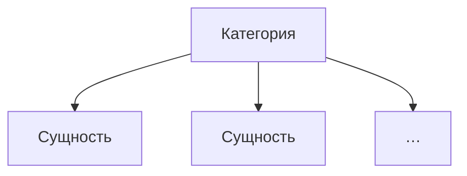

# Структура категории

Открывайте этот раздел, чтобы решить, когда объединить равноправные сущности
по общему признаку и где разместить такую категорию.

```mermaid
flowchart TB
  category["Категория"] --> entity1["Сущность"]
  category --> entity2["Сущность"]
  category --> more["…"]
```
