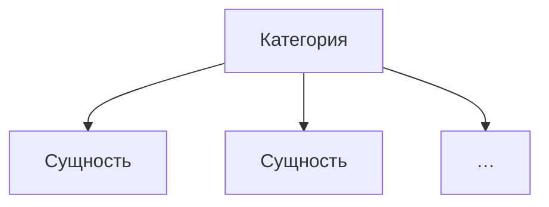

# Для чего нужна категория

> Переходное описание прежней структуры. Целевые правила принадлежат
> [единому стандарту](../../notes/draft-structure.md); этот материал сохраняет
> ещё используемые детали обнаружения и не вводит классы Entity/Category.

Открывайте этот раздел, чтобы решить, когда объединить равноправные сущности
по общему признаку и где разместить такую категорию.

