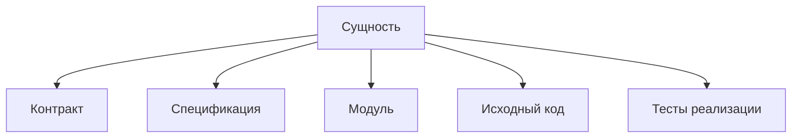

# Какие части принадлежат сущности

> Переходное описание прежней структуры. Целевые правила принадлежат
> [единому стандарту](../../notes/draft-structure.md); этот материал сохраняет
> ещё используемые детали обнаружения и не вводит классы Entity/Category.

Открывайте этот раздел, чтобы оформить самостоятельную сущность с одним основным
экспортом, публичным контрактом, исходным кодом и локальной спецификацией.

Правила объединения сущностей в категории, преобразования в пакет и размещения
по принадлежности описаны в [развитии структуры](../../notes/development.md).
Размещение `spec` и `test` определено в
[правилах проверок](../../notes/development.md#спецификации-и-тесты-реализации).
