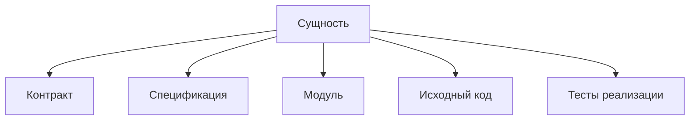

# Структура сущности

Открывайте этот раздел, чтобы оформить самостоятельную сущность с одним основным
экспортом, публичным контрактом, исходным кодом и локальной спецификацией.

Правила объединения сущностей в категории, преобразования в пакет и размещения
по принадлежности описаны в [развитии структуры](../README.md#развитие-структуры).
Размещение `spec` и `test` определено в
[правилах проверок](../README.md#спецификации-и-тесты-реализации).

## Краткие пути импортов

В статических, динамических и type-only импортах директорий имена `index.ts`
и `index.tsx` опускаются: `./fixture` вместо `./fixture/index.ts`,
`../component` вместо `../component/index.tsx`. Краткий путь должен разрешаться
в тот же существующий модуль. Для сокращения импорта не создаются новые
index-файлы или реэкспортные фасады.

Пути к файлам в `package.json#exports` остаются явными: это цели экспортов.

Это правило предстоит проверить отдельным тестом структуры импортов.
