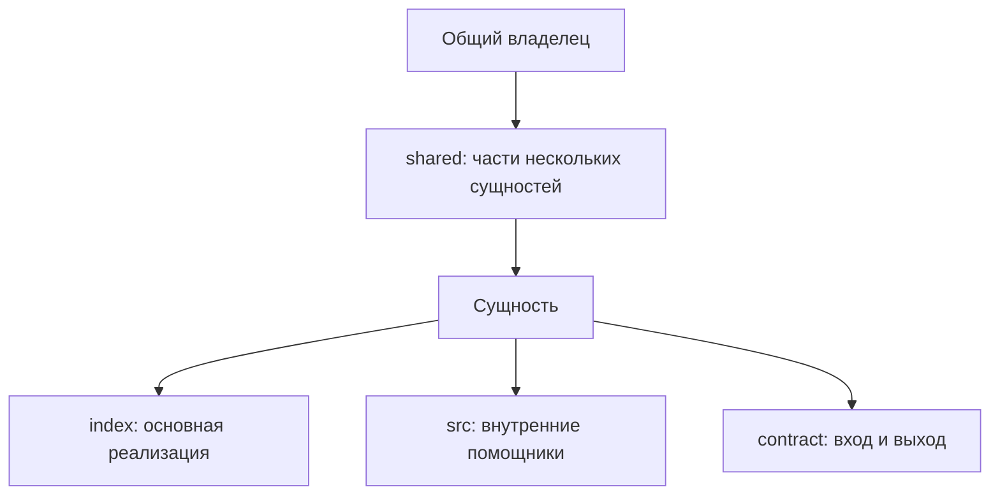

# Где размещать сущность, её помощники и общие части

Сущность имеет собственный вход. Внутренние помощники остаются у неё,
а части, нужные нескольким сущностям, принадлежат общему владельцу.
Ниже также описан структурный обход директорий; детали представления нужно
сверять с текущей реализацией.

## Вход сущности и её внутренние части

Предметная панель выбранного пакета раскрывает структурные категории до
директорий компонентов и модулей. Собственный публичный `index.tsx` является
границей компонента без обязательного `src/`: сам компонент виден, его
внутренности не обходятся. Реализация или композиция находится непосредственно
в `index.tsx`.

Публичный вход одного предмета содержит одну основную экспортируемую исполняемую
сущность: компонент, функцию или другой рассматриваемый объект. Вход компонента —
`index.tsx`, невизуального предмета — `index.ts`. Непосредственная реализация и
композиция этой сущности остаются во входе; заменять их реэкспортным фасадом нельзя.
Дополнительные самостоятельные предметы получают собственные каталоги.
[Публичные входы пакета и экспорт контрактных типов](../../package/notes/draft-exports.md).

Отдельные вспомогательные функции и частные компоненты отображения
верхнего уровня выносятся из входного файла в собственную `src/`. Их небольшой
размер не является основанием оставлять несколько таких сущностей во входе.
Локальные обработчики и callbacks внутри основной реализации остаются её частью.
Связанные помощники могут находиться в одном частном файле; правило не требует
одного экспорта в каждом файле `src`. Код, используемый несколькими самостоятельными
компонентами, размещается в `shared/` соответствующего пакета.
Размещение вспомогательных типов пока не определено. Используемые варианты
и отложенное решение описаны [в заметке о контрактах](../../specs/contracts/notes/draft-contracts.md#где-описывать-вспомогательные-типы).
Если выносить нечего, `src/` не создаётся. Входные и выходные типы предмета описываются
в `contract/input.ts` и `contract/output.ts` по [контракту документации](../../specs/contracts/notes/draft-contracts.md).
Наличие вспомогательных исполняемых объявлений во входе — нарушение структуры, даже если
публично экспортируется только основной компонент и тесты поведения проходят.
Существующие модули с собственным `src/` сохраняют границу, включая невизуальные
модули с `index.ts`. Сам по себе `index.ts`, включая barrel, не завершает обход:
промежуточные директории раскрываются рекурсивно. Содержимое exports и re-exports
не классифицирует узлы; публичные package exports задают API независимо от меню.

## Имя и описание в интерфейсе

Название структурного узла берётся из имени на диске. Обзор категории или
компонентной директории берётся только из начального TSDoc-блока
`@packageDocumentation` её публичного `index.tsx`, а при отсутствии допустимого
`index.tsx` — из `index.ts`. Игнорируемые Git файлы и symlink не выбираются.
При наличии обоих файлов `index.tsx` имеет приоритет даже без TSDoc; описания
не объединяются. Наличие допустимого `index.tsx` задаёт границу без анализа JSX
или экспортов. Корневой `index.ts` или `index.tsx` также содержит
модульный TSDoc. Текущий runtime всё ещё читает пакетный README.md, но
целевой обзор пакета переносится в код и публичные контракты. README.md не
является источником для обычной директории;
существующие файлы и их содержание сохраняются. Если публичный входной файл или описание
отсутствуют, директория остаётся видимой с явным пустым обзором.
TypeScript не исполняется. Markdown, блоки кода, @remarks и @example сохраняются
в текстовой проекции; документация классов и функций в обзор не включается.
Исходник наблюдается общим watcher; текст входит в снимок каталога и публикуется
как module.md только после проверки digest исходника. Пакетные вкладки получают
новое описание после успешной сборки и применения ревизии. Локальные ресурсы
разрешаются относительно выбранного входного файла через общий Markdown allow-list.
Служебные `src`, `shared`, `spec`, `fixture`, test-директории и директории с
начальной точкой не становятся публичными сегментами маршрута. Остальные исключения
определяет Git через `git check-ignore --no-index`: учитываются вложенные
`.gitignore` и правила с `!`, включая уже отслеживаемые Git каталоги.
Имена `build` или `dist` сами по себе не являются основанием для исключения.
Пакет с `package.json` не обходится как обычная директория; состав пакетов
определяется `package.json#workspaces` и физической структурой.
Symlink-директории не обходятся. Пустые директории остаются видимыми.
Обход продолжается через категории и обычные директории до ближайшего модуля с `index.tsx` или `src/`.
Иерархия самостоятельно обнаруженных пакетов в главной панели сохраняется.

## Путь к сущности в интерфейсе

Directory nodes проходят через тот же нормализованный каталог, граф, поиск и
revision snapshot. Публичный pathname следует пути выбранного физического
корня и реальным видимым директориям: `numeric/number` остаётся
`numeric/number` внутри адреса своего пакета. Встроенное представление выбирается
только UI query-параметром `view`; правило маршрутизации принадлежит
[Route](../../../route/README.md) и [контракту вкладок](../../../requirements.md#tabs-routes).
`routePath` с внутренними `dir-` сегментами не задаёт публичный URL. MCP пока
адресует только пакет целиком, без директорий, представлений и вариантов;
эта граница описана в [MCP Address](../../../mcp/address/README.md).
Варианты определяются исполняемым spec владельца, а не отдельным JSON-каталогом.

## Связь с представлениями

Сценарии обнаруживаются у физического владельца по его spec.
Несколько вариантов одного модуля остаются у этого
модуля. Как выражать несколько различных представлений одной сущности без
дублирования её кода, ещё требует решения у
[владельца вопроса](presentation-ownership.md).

## Обновление после изменения файлов

Изменения директорий и `.gitignore` наблюдает общий watcher. Изменение директории
родительского пакета не меняет сборки дочерних пакетов. Навигация внутри пакета
использует его применённую ревизию и тот же Root.
