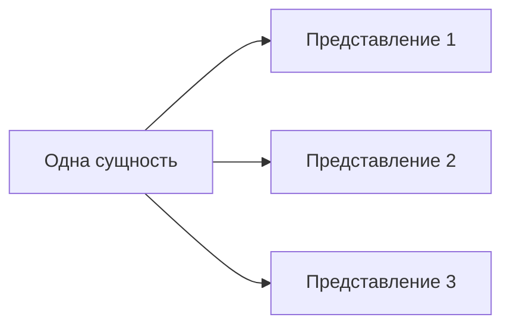

# Как связать готовые представления с сущностью

Речь о прежних декларативных subjects: несколько представлений можно связать
с одной сущностью, не превращая каждое представление в отдельную сущность.
Это отдельный механизм от каталога, получаемого из сценариев.

Этот пример описывает существующие authored subjects. Целевые структурные
сценарии из spec определены в [правиле сценариев](../../specs/scenarios/notes/draft-structural-scenarios.md).

Пример привязки: `"directory": "numeric/number"` у authored subject.
Она связывает сценарии с уже обнаруженным модулем из примера. Строка number
может показывать авторские варианты, сохраняя их адреса, например
`parameters/number/field`, без дублирования компонента.

Несколько preset-представлений Socket иллюстрируют другой случай: разные views
относятся к одному модулю, не становятся самостоятельными компонентами или
пакетами. Нормативные правила one/many bindings и удаления опустевшей категории
находятся в [контракте subject.directory](draft-placement.md).
