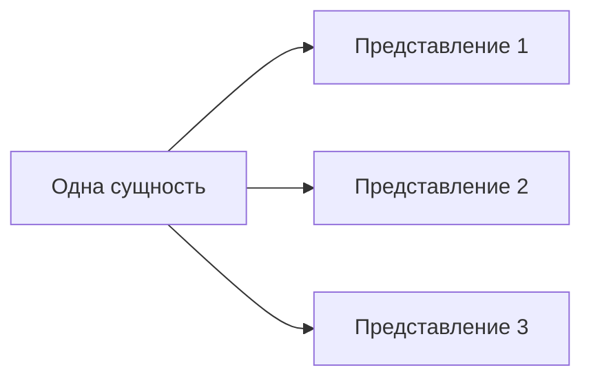

# Как связать готовые представления с сущностью

Несколько представлений могут относиться к одной сущности, не превращая каждое
представление в отдельную сущность. Способ выражения этой связи в коде и spec
ещё не согласован.

Структурные сценарии из spec определены в
[правиле сценариев](../../specs/scenarios/notes/draft-structural-scenarios.md).
Например, модуль `numeric/number` может иметь несколько вариантов без
дублирования компонента; их принадлежность следует из расположения spec.

Несколько preset-представлений Socket иллюстрируют открытый вопрос: разные представления
относятся к одному модулю, не становясь самостоятельными компонентами или
пакетами. Нужны исполняемый пример и проверка того, достаточно ли структуры
spec для этой связи. Проектную декларацию привязки создавать не следует.
