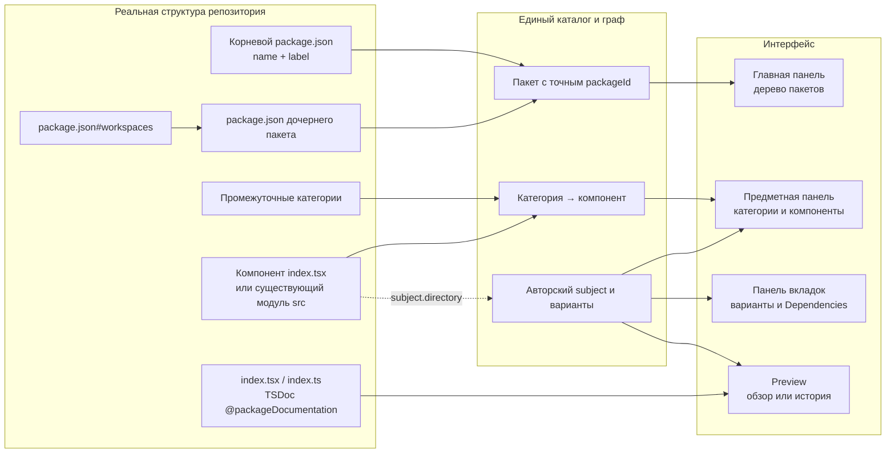

# Схема и примеры размещения

Черновой материал из прежних описаний. Требует сверки с текущим кодом и принятыми решениями; положения о README, форматах файлов и способах исполнения могут быть устаревшими.

## От файлов на диске до панелей Storybook



В этой схеме discovery передаёт сведения о пакетах, каталогах и документации
в нормализованный граф. UI и MCP проецируют этот же результат; package exports
остаются отдельным описанием API. Точные границы обхода заданы в
[контракте каталогов и компонентов](../entity/notes/draft-placement.md).

## Размещение существующих декларативных представлений

```text
ГЛАВНАЯ ПАНЕЛЬ
└─ корневой пакет                ← выбранный путь + package.json#name
   └─ дочерний пакет             ← workspaces + package.json#name

ПРЕДМЕТНАЯ ПАНЕЛЬ ВЫБРАННОГО ПАКЕТА
├─ категория                     ← промежуточная директория
│  └─ компонент                  ← каталог с index.tsx
│     └─ представления           ← несколько привязанных subjects, если есть
└─ непривязанная JSON-категория
   └─ subject

ПАНЕЛЬ ВКЛАДОК
├─ варианты subject              ← catalog.json; исходные routes
└─ Dependencies                  ← найденный spec; собственный route

ЦЕНТРАЛЬНАЯ ОБЛАСТЬ
├─ TSDoc index.tsx / index.ts    ← компонент или категория
├─ README пакета                 ← авторский пакетный обзор
└─ исполняемая история           ← module.path + module.export
```

Источники документации, исключения и границы пакетов и модулей определены
в [разделе требований выше](draft-structure.md).
Обзор открывается кликом по предмету, а адресуемые вкладки — по
[контракту Панели вкладок](../../requirements.md#tabs-routes).

Структура, декларации, поиск, UI и MCP используют один нормализованный граф.
Описание и ресурсы попадают в immutable revision; пользовательские вкладки
получают изменения после успешной сборки и применения. Родительская
вложенность не объединяет сборки, Stores, ревизии или runtime дочерних пакетов.
