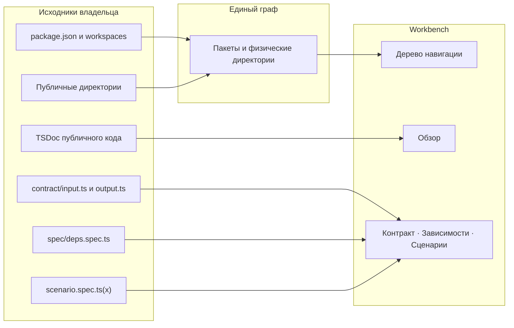

# Как файлы становятся панелями Storybook

Панели показывают структуру владельца, описанную в
[правилах Archetypes](draft-structure.md). Обнаружение передаёт пакеты и
физические директории в один нормализованный граф. UI показывает физические
директории и их встроенные представления; текущий MCP адресует только пакеты
этого графа по [своему контракту](../../mcp/address/README.md).

Обзор и вкладки получают содержание из кода, публичных контрактов, TSDoc и
результатов исполняемых spec. Для публичной директории используется модульный
TSDoc, если он есть. Корень пакета использует тот же читатель начального TSDoc
его index; отсутствие описания явно, README не используется как fallback.
Обзор и вкладки используют [один адресный контракт](../../requirements.md#tabs-routes).
Вложенный пакет имеет собственную ревизию и исполнение сценариев, даже когда
его физический путь проходит через директории родителя. `package.json#exports`
описывает публичный API пакета и не определяет узлы навигации.
