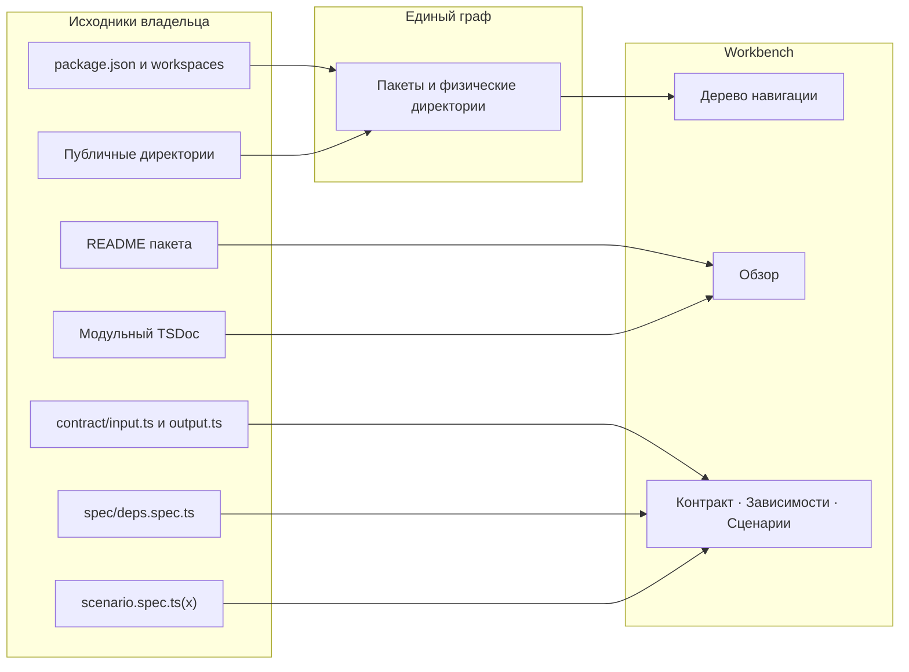

# Как файлы становятся панелями Storybook

Панели показывают структуру владельца, описанную в
[правилах Archetypes](draft-structure.md). Обнаружение передаёт пакеты и
физические директории в один нормализованный граф; UI и MCP проецируют
тот же результат.

Пакет получает обзор из README; публичная директория — из модульного TSDoc,
если он есть. Вкладки появляются только при найденных файлах владельца.
Обзор и вкладки используют [один адресный контракт](../../requirements.md#tabs-routes).
Вложенный пакет имеет собственную ревизию и исполнение сценариев, даже когда
его физический путь проходит через директории родителя. `package.json#exports`
описывает публичный API пакета и не определяет узлы навигации.
