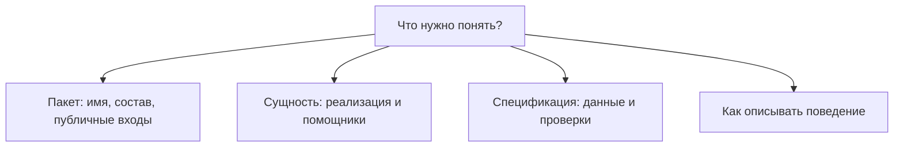

# Где искать описание нужной части системы

Archetypes объединяет правила для визуальных и невизуальных сущностей.
Конкретное описание размещается рядом с тем, кому принадлежит соответствующая
ответственность. Общие документы ссылаются на него и не создают вторую версию.

- Создание пакетов относится к [Package](../package/index.ts).
- Имя и вложенные пакеты описаны в [заметке об идентичности](../package/package-json/notes/draft-identity.md).
- Размещение сущности и её частей — в [заметке о принадлежности](../entity/notes/draft-placement.md).
- Зависимости — в [заметке о графе зависимостей](../specs/deps/notes/draft-dependencies.md).
- Вход и выход — в [заметке о контрактах](../specs/contracts/notes/draft-contracts.md).
- Сценарии — в [заметке о представлении сценариев](../specs/scenarios/notes/presentation.md).
- Документация кода — в [заметке об описании поведения](draft-documentation.md).
- Переход от файлов к панелям — в [схеме представления](draft-projections.md).

Маршруты вкладок принадлежат [контракту Панели вкладок](../../requirements.md#tabs-routes).
Формат ожидаемого состава зависимостей остаётся у владельца спецификации зависимостей.

В прежнем описании обычная директория получала обзор из модульного TSDoc index.tsx
или index.ts, а пакет — из README. Правило чтения README пока сохраняется;
цель перехода к сведениям из кода описана в [жизненном цикле заметок](note-lifecycle.md).
