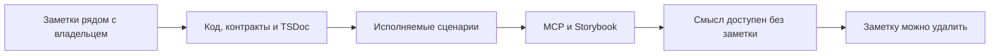

# Как переносить смысл заметок в код

Заметки временно сохраняют черновики, прежние описания и ещё не выраженные
в коде решения. Они размещаются в `notes` рядом с сущностью или пакетом,
которому принадлежит описываемая ответственность. Общий смысл остаётся
у общего владельца; тематическая близость не заменяет принадлежность.
README служит указателем на заметки, а не вторым изложением их содержания.

При разборе прежних документов содержание классифицируется по смыслу и
распределяется по владельцам. Уникальные сведения сохраняются. Противоречивые
или устаревшие положения обозначаются как требующие сверки и не становятся
действующими правилами только вследствие переноса.

По мере реализации смысл заметок переносится в структуру кода, публичные
контракты, TSDoc существующих объявлений и исполняемые спецификации.
MCP и визуальное представление Storybook должны получать эти сведения
из структуры кода и результатов сценариев.

Заметка становится ненужной, когда всё её полезное содержание выражено
у соответствующих владельцев в коде и доступно человеку и агенту через
предусмотренные представления. До этого её сохраняют: перенос файла или
прохождение отдельного теста не доказывают, что смысл уже перенесён полностью.
Цель — постепенно избавиться от заметок, не потеряв описанные в них знания.
