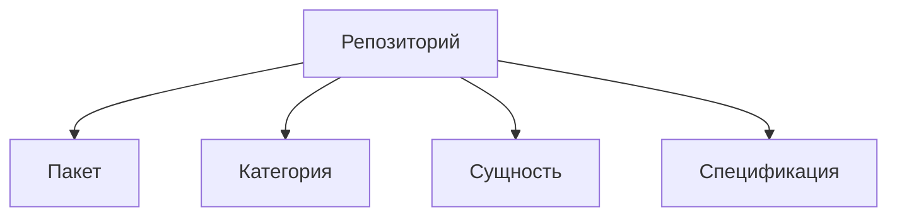

# Что может находиться в репозитории

```mermaid
flowchart TB
  repository["Репозиторий"] --> package["Пакет"]
  repository --> category["Категория"]
  repository --> entity["Сущность"]
  repository --> spec["Спецификация"]
```
