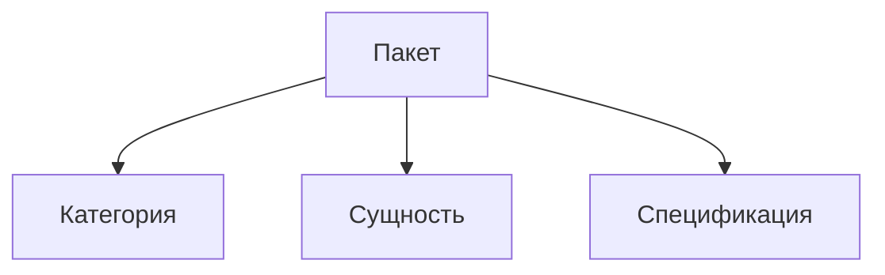

# Структура пакета

## Входной путь проверок

Путь к проверяемому пакету выбирается явно в файле спецификации:
из переменной окружения либо из пути к фикстуре по умолчанию.
Подготовка фикстуры получает выбранный путь аргументом и не читает
переменную окружения скрыто внутри себя.

Это правило предстоит проверить тестом структуры самих спецификаций.
