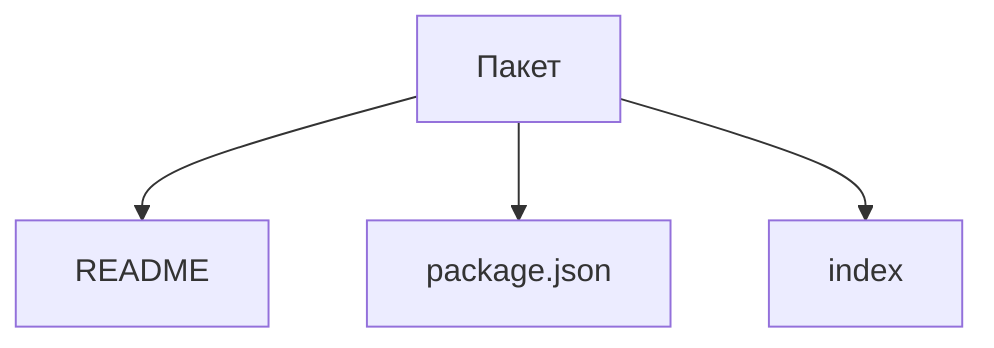

# Структура пакета

Открывайте этот раздел, чтобы решить, когда выделить самостоятельный пакет
и как оформить его identity, публичные exports, состав и зависимости.

Пакет размещает спецификации в `spec`, а проверки внутренних механизмов —
в `test` согласно [общему правилу](../README.md#спецификации-и-тесты-реализации).

Пакет `@archetypes/package` владеет тремя сущностями обязательного файлового
состава: `readme`, `package-json` и `index`. Для package.json реализовано чтение
согласованных полей; README и index пока остаются каркасами.

## Виды пакета по положению

Корневой пакет непосредственно принадлежит репозиторию. Вложенный пакет
непосредственно принадлежит другому пакету. Это структурные роли;
наличие package.json и workspaces не определяет их само по себе.
Репозиторий и монорепозиторий рассматриваются отдельно в архетипе репозитория.

## Входной путь проверок

Путь к проверяемому пакету выбирается явно в файле спецификации:
из переменной окружения либо из пути к фикстуре по умолчанию.
Подготовка фикстуры получает выбранный путь аргументом и не читает
переменную окружения скрыто внутри себя.

Это правило предстоит проверить тестом структуры самих спецификаций.
