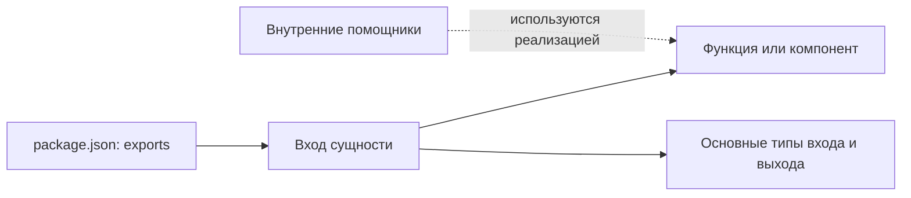

# Какие функции и типы доступны из пакета

Публичный путь ведёт к входу самостоятельной сущности.
Из этого входа доступны основная функция или компонент и основные типы входа и выхода.
Внутренние помощники не становятся публичными только потому, что лежат в отдельном файле.

В `package.json#exports` публичный кодовый путь может указывать только на основной
`index.ts` или `index.tsx` оформленной сущности. Одной сущности соответствует ровно
один такой экспортный путь, включая `.` для сущности в корне пакета. Повторные пути,
алиасы и прямые экспорты внутренних файлов вместо входа сущности запрещены.
Категория или агрегатор без собственной сущности не создаёт дополнительный
кодовый экспорт. Некодовые ресурсы сохраняют отдельные требования своих владельцев.

Index явно реэкспортирует через `export type` только основные интерфейсы своего
input/output из contract вместе с единственной исполняемой сущностью. Другие
экспорты типов из этого index запрещены, включая вспомогательные типы и типы
внутренних результатов. Файлы contract/input.ts и contract/output.ts не получают
дополнительных путей в `package.json#exports`: их типы доступны через основной вход.
Файлы types, shared/types, src и частные служебные модули не публикуются отдельными
кодовыми путями без оформления самостоятельной сущности.

Пример текущего публичного входа — [readScenario и его контракты](../../specs/scenarios/index.ts).
Сам список экспортов Specs находится в [package.json](../../specs/package.json).
