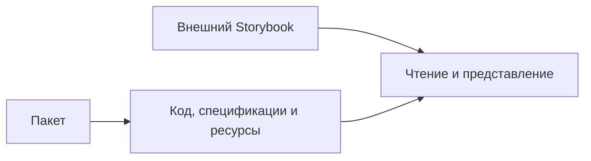

# Что принадлежит пакету, а что — Storybook

Пакет владеет своим содержимым и ресурсами. Storybook предоставляет внешнее
средство их просмотра. Эта заметка удерживает границу между этими ответственностями.

### Почему Storybook остаётся внешним инструментом

Consumer project/package не содержит dependency, devDependency,
peerDependency, type import или runtime import `@zavx0z/storybook`, private
package `@scope/storybook`, package-local server/build/launcher либо собственный
Storybook port/process. Shared repository может иметь implementation
dependencies.

### Какие данные и ресурсы принадлежат пакету

Package владеет versioned JSON manifest/catalog, semantic ordering,
README/stories/fixtures/tests/media/references и optional structural runtime.
Declaration хранит links, а не copied source/README/CSS или executable code.

### Отдельный пакет и несколько подключённых проектов

Standalone package, one-package project, multi-package project, workspace и
несколько independently attached roots поддерживаются одинаково. Workspace не
является обязательным global registry и не создаётся искусственно.
