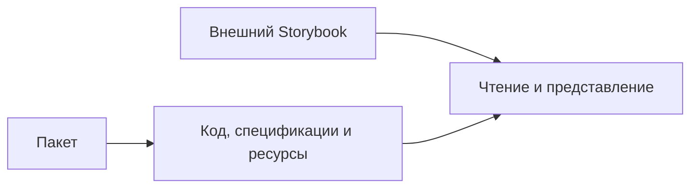

# Что принадлежит пакету, а что — Storybook

Пакет владеет своим содержимым и ресурсами. Storybook предоставляет внешнее
средство их просмотра. Эта заметка удерживает границу между этими ответственностями.

```mermaid
flowchart LR
  package["Пакет"] --> data["Код, спецификации и ресурсы"]
  tool["Внешний Storybook"] --> read["Чтение и представление"]
  data --> read
```

### Почему Storybook остаётся внешним инструментом

Пакет-потребитель не содержит dependency, devDependency,
peerDependency, type import или runtime import `@zavx0z/storybook`, private
package `@scope/storybook`, package-local server/build/launcher либо собственный
Storybook port/process. Собственные implementation dependencies Storybook
остаются внутри репозитория инструмента.

### Какие данные и ресурсы принадлежат пакету

Пакет владеет кодом, публичными контрактами и exports, TSDoc, исполняемыми
spec и их результатами, fixtures, tests и ресурсами. Семантический порядок
получается из структуры и исполняемых источников владельца. README указывает
на временные заметки. Проектный JSON manifest/catalog, перечни вкладок,
widget contributions и overrides автор не создаёт.

### Project и подключённые Repo

Project объединяет ссылки на независимые пакеты Repo. Один Repo может входить
в несколько проектов без копии кода и identity. Общий инструмент не становится
владельцем исходников подключённых пакетов.

Действующий механизм подключения также умеет принимать отдельный пакет или
несколько физических корней. Эта возможность не заменяет целевой контракт
Project и не доказывает, что произвольный корень является Repo. Состав пакетов
внутри Repo раскрывается из штатного `package.json#workspaces`.
