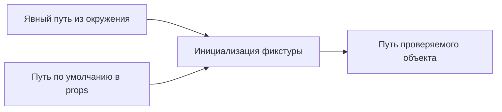

# Как выбрать внешний путь или фикстуру

Путь к проверяемому пакету выбирается явно в файле спецификации:
из переменной окружения либо из пути к фикстуре по умолчанию.
Подготовка фикстуры получает выбранный путь аргументом и не читает
переменную окружения скрыто внутри себя.

`createFixture` возвращает функцию выбора пути. Внешний путь разрешается
от рабочей директории запуска. Если он не передан, относительный путь
по умолчанию разрешается от вызывающего файла .spec.ts(x) или .test.ts(x); абсолютный путь
сохраняется. Имя директории `fixture` не добавляется автоматически:
при необходимости оно явно присутствует в аргументе, например
`resolvePath("fixture/repository/package")`.

Это правило предстоит проверить тестом структуры самих спецификаций.

Пример явной инициализации — [сценарий Specs](../../specs/spec/scenario.spec.tsx).
Выбор пути выполняет [общий помощник фикстур](../../shared/fixtures/index.ts).
