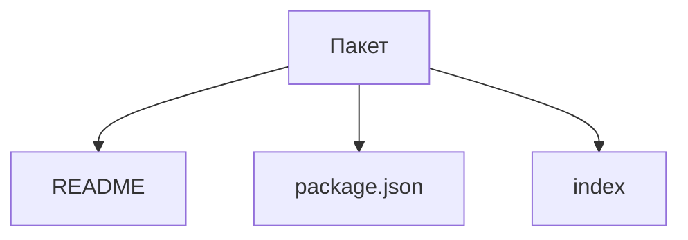

# Какие файлы описывают пакет

Открывайте этот раздел, чтобы решить, когда выделить самостоятельный пакет
и как оформить его identity, публичные exports, состав и зависимости.

Пакет размещает спецификации в `spec`, а проверки внутренних механизмов —
в `test` согласно [общему правилу](../../notes/development.md#спецификации-и-тесты-реализации).

Пакет `@archetypes/package` владеет тремя сущностями обязательного файлового
состава: `readme`, `package-json` и `index`. Для package.json реализовано чтение
согласованных полей; README и index пока остаются каркасами.

Сейчас [readPackage](../index.ts) передаёт чтение package.json
его [собственному обработчику](../package-json/index.ts).
