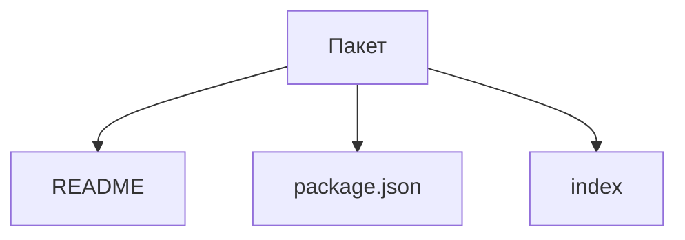

# Какие файлы описывают пакет

Открывайте этот раздел, чтобы решить, когда выделить самостоятельный пакет
и как оформить его identity, публичные exports, состав и зависимости.

Пакет размещает спецификации в `spec`, а проверки внутренних механизмов —
в `test` согласно [общему правилу](../../notes/development.md#спецификации-и-тесты-реализации).

Пакет `@archetypes/package` владеет чтением трёх частей файлового состава:
`readme`, `package-json` и `index`. [readPackage](../index.ts) объединяет
их результаты для выбранной директории. Манифест сообщает идентичность и
назначение; README объясняет пакет; exports связывают публичные пути с кодом
и ресурсами. Раздел документации не становится отдельным публичным экспортом.

[Сценарий пакета](../spec/scenario.spec.ts) проверяет существование и принадлежность
файлов входов, отсутствие кодовых псевдонимов и наличие контрактов. Условные
ветви сохраняются без выбора среды. Шаблоны и fallback-массивы явно остаются
непроверенными. Закрытый через null экспорт не считается отсутствующим файлом.

Проверки не анализируют семантику исполняемого кода. Предложения о единственном
компоненте пакета, размещении Store и функциях обогащения данных остаются
незавершёнными пунктами сценария, а не результатом файловой проверки.
