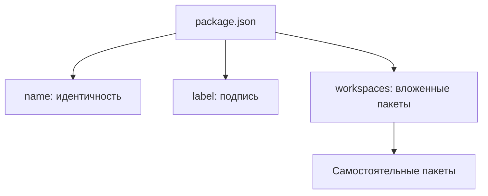

# Откуда берутся имя пакета и вложенные пакеты

package.json задаёт имя, подпись и состав вложенных пакетов.
Путь на диске показывает местоположение; он не заменяет имя пакета.
Ниже сохранены детали прежнего обнаружения, включая совместимость старых объявлений.

### Имя пакета и состав вложенных пакетов

Манифест пакета не содержит `kind`, `id` и `packageJson`; resolver, схема и
генератор согласованно отклоняют или не создают эти поля. Владелец — корень
директории `.storybook`, его `package.json` является единственным источником
имени и metadata. Этот этап не меняет прежние project/workspace форматы
композиции, `runtime`, `catalog`, stylesheets, widgets и маршруты сценариев.

## Имя и вложенные пакеты

Identity каждого владельца равна точному `package.json#name`, включая выбранный
корень репозитория. `label` задаёт подпись, выбранный путь — местоположение.
Имя папки и legacy manifest.id не создают альтернативную identity. Каждый
владелец имеет ровно один пакетный узел; project/repository оболочки отсутствуют.
Workspaces раскрываются рекурсивно у любого пакета, с устранением повторного
обнаружения того же источника. Разные источники одного имени отклоняются.
Состав вложенных пакетов задаётся package.json#workspaces через Bun.Glob:
точные пути, `*`, `**` и исключения `!`. Порядок шаблонов сохраняется, внутри
шаблона пути упорядочены; пересечения не создают дублей. Каталог без package.json
не становится пакетом. `node_modules`, `.git`, выход за корень и symlink-пакеты
не включаются. manifest.packages остаётся для прежней композиции без workspaces;
оба источника состава одновременно не используются.

## Независимое обновление пакетов

Корневые и вложенные пакеты имеют независимые сборки, ревизии и диагностику.
Корневой README следует тому же механизму применения ревизии пакета.
История старых URL обеспечивает перенаправление к существующему пакету без
введения новых identity. Формат старых опубликованных снимков сохраняется
читаемым до их замены проверенной ревизией.

## Недоступный пакет

Временно недоступный сохранённый путь без читаемого package.json остаётся
записью ошибки `unavailable`, а не пакетом с выдуманным именем. Для него
не создаётся PackageSession. Уже известные пакеты сохраняют последнюю
проверенную identity и независимые рабочие ревизии при ошибках родителя.

## Подпись пакета

`package.json#label` определяет название
при открытии и обновлении и обязателен для каждого корня и пакета.
Поле label в manifest запрещено. Init читает название из package.json
и не создаёт отдельное название в manifest.

Чтение согласованных полей package.json находится в [readPackageJson](../index.ts).
Это локальное чтение данных; оно само по себе не подтверждает все описанные
здесь правила обнаружения и независимого обновления пакетов.
