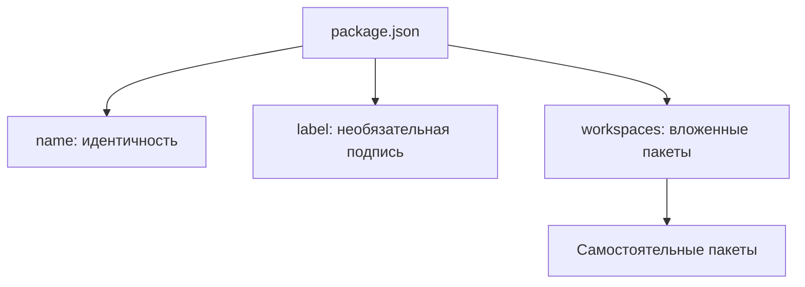

# Откуда берутся имя пакета и вложенные пакеты

package.json задаёт имя, необязательную подпись и состав вложенных пакетов.
Путь на диске показывает местоположение; он не заменяет имя пакета.
`package.json` содержит npm metadata; он не является проектной декларацией Storybook.

### Имя пакета и состав вложенных пакетов

Источником имени и npm metadata является `package.json` физического пакета.
Служебное состояние в `~/.storybook` и сохранённый список подключённых корней не
задают package identity. Сведения о пакете читаются у его владельца в коде
без отдельной проектной декларации Storybook.

## Имя и вложенные пакеты

Identity каждого владельца равна точному `package.json#name`, включая выбранный
корень репозитория. Необязательный `label` задаёт подпись; без него
используется имя пакета. Выбранный путь задаёт местоположение.
Имя папки не создаёт альтернативную identity. Каждый
владелец имеет ровно один пакетный узел; project/repository оболочки отсутствуют.
Workspaces раскрываются рекурсивно у любого пакета, с устранением повторного
обнаружения того же источника. Разные источники одного имени отклоняются.
Состав вложенных пакетов задаётся package.json#workspaces через Bun.Glob:
точные пути, `*`, `**` и исключения `!`. Порядок шаблонов сохраняется, внутри
шаблона пути упорядочены; пересечения не создают дублей. Каталог без package.json
не становится пакетом. `node_modules`, `.git`, выход за корень и symlink-пакеты
не включаются. Состав определяется только workspaces и текущей физической структурой.

## Независимое обновление пакетов

Корневые и вложенные пакеты имеют независимые сборки, ревизии и диагностику.
Текущий runtime включает корневой README в ревизию пакета. Целевое содержание
обзора переносится в код, контракты, TSDoc и исполняемые spec.

## Недоступный пакет

Временно недоступный сохранённый путь без читаемого package.json остаётся
записью ошибки `unavailable`, а не пакетом с выдуманным именем. Для него
не создаётся PackageSession. Уже известные пакеты сохраняют последнюю
проверенную identity и независимые рабочие ревизии при ошибках родителя.

## Подпись пакета

`package.json#label` может задать отображаемое название; без него Storybook
показывает `package.json#name`. Параллельная проектная декларация названия
не создаётся.

Нынешние [readPackageJson](../index.ts) и
[сценарий](../spec/scenario.spec.ts) всё ещё требуют `label`, тогда как
[обнаружение пакетов](../../../../discovery/packages.ts) допускает его отсутствие
и использует имя пакета.
Это разрыв реализации, а не требование к автору. Локальное чтение само по
себе не подтверждает все правила обнаружения и независимого обновления пакетов.
