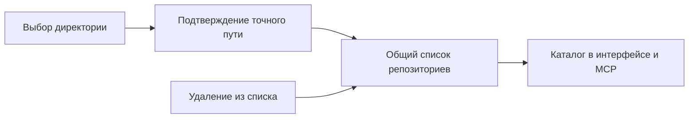

# Как добавлять и убирать репозитории в Storybook

Project объединяет выбранные независимые пакеты Repo. Один Repo может входить
в несколько проектов без копирования исходников и identity. Понятие Project
не заменяется термином из интерфейса редактора или названием npm-поля workspaces.

[readProject](../index.ts) проверяет переданный набор Repo, повторные identity
и вложенность выбранных корней. Ниже описан действующий механизм подключения
Storybook. Он хранит один список выбранных корней; полноценное сохранение
нескольких именованных Project этим механизмом пока не реализовано.
Подключение сохраняет физические корни; пакетный состав раскрывается из
`package.json#workspaces` без проектной конфигурации Storybook.

## Действия человека

Landing показывает кнопку добавления справа от поиска и кнопку удаления при
наведении на строку выбранного репозитория. Крестик расположен
внутри общей подсветки строки; место под него зарезервировано, чтобы название
не пересекалось с кнопкой. Удаление не активирует переход по строке.
Добавление вызывает
native `showDirectoryPicker` непосредственно из пользовательского события, до
сетевых запросов. Форма ввода пути и загрузка копии проекта не используются.
Одноразовая метка в выбранной папке связывает directory handle с точным серверным
каталогом; подтверждение ограничено session и сроком действия. Метка удаляется
браузером после запроса. Совпадения одного имени папки недостаточно. Отмена picker
оставляет каталог без изменений; ошибки показываются в той же области.
Удаление не изменяет исходники. Действующий механизм также умеет исключать
вложенный пакет из списка подключённых корней с сохранением соседей. Это операция
переходного каталога, а не разрешение вложенных Repo в целевом Project.
Повторное добавление не создаёт дубликат.

## Текущий список подключённых корней

UI и MCP attach/detach используют один серверный путь изменения реестра.
Browser mutation требует origin и действующую registry session; package session
не получает этого права. Изменения сериализуются. Выбор хранится в `~/.storybook/projects.json` как
JSON-массив абсолютных каталогов, отдельно от состояния процесса и кэша.
Ни имена, ни идентификаторы, ни исключения в нём не сохраняются.
Состав не восстанавливается из истории процессов; корни задаются явно.
При удалении вложенной ветви оставшиеся ветви становятся явными выбранными
корнями без изменения файлов владельца. Название пакета определяется [правилами metadata](../../package/package-json/notes/draft-identity.md).
Пустой сохранённый список не заменяется стартовыми roots.
Обновление списка сохраняет текущий Root; удаление выбранной ветви переводит
навигацию в корень. Workbench остаётся работоспособным при пустом каталоге.
