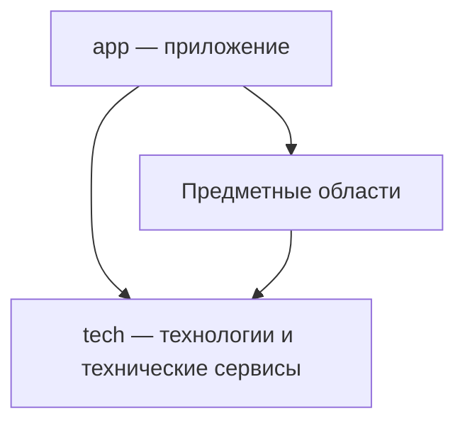

# Предметная архитектура проекта

Архитектурный стиль организации кода, ответственности и зависимостей проекта
опирается на [Основания](../../project/notes/foundations/index.md).
Предметные сущности выражают смысл системы; технологии обеспечивают их
реализацию; приложение соединяет подготовленные возможности.

Эта заметка — временный единый источник согласованных принципов на время
формирования архитектуры Storybook. Правила уточняются здесь, чтобы сохранять
одно место правок до их раскрытия агентам через MCP. Текущая реализация и её
границы описаны в [архитектуре Storybook](../../../ARCHITECTURE.md);
наличие целевого правила ещё не означает завершённую миграцию.

Для Storybook согласован верхний уровень: `project`, `repo`, `package`,
`domain`, `component`, `container`, `contracts`, `specs`, `tech` и `app`. Предметные области получают
самостоятельных владельцев в корне; общий контейнер `archetypes` расформируется.
Каталог и ревизии не вводятся отдельными корневыми предметными областями:
предметные операции переходят к своим владельцам, общая композиция — в `app`,
а чисто технические механизмы — в `tech`.

Миграция выполняется согласованными порциями с проверками, коммитом и push
после завершённого этапа. Сначала существующий функционал раскладывается
по пакетам и доменам с сохранением поведения. Исправление логики и добавление
возможностей следуют после структурного переноса. Исторические имена пакетов
сами по себе не определяют физическую принадлежность; изменение identity
не требуется только из-за перемещения её единственного владельца.

## Области репозитория

На верхнем уровне Repo находятся технологии, необязательное приложение
и самостоятельные предметные области. Их конкретный состав определяется
назначением проекта.

```text
repo/
├── tech/
├── app/          при наличии собственного приложения
├── subject-a/
└── subject-b/
```

### Технологии

`tech` владеет всей технологической частью: настройкой, инициализацией,
жизненным циклом, вспомогательными сущностями, контрактами и объединением
технологий в сервисы. Здесь находятся технические возможности работы
с базами данных, транспортами, серверами и другими средствами реализации.

Технический сервис может соединять несколько технологий. Его состав
и поведение остаются технологическими: `tech` не использует предметные
сущности приложения и не зависит от `app`.
Вспомогательные сущности внутри `tech` выражают технические обязанности
и не принимают на себя предметные правила приложения.

### Предметные области

Предметная сущность определяется смыслом системы. Это может быть репозиторий,
сценарий, чат, узел графа или понятие языка. Термин применим и к приложениям,
и к техническим библиотекам.

Предметные области владеют правилами, контрактами и реализацией своих
возможностей. Они используют `tech`, максимально подготавливая эти возможности
к использованию в `app`: предметная работа с технологиями реализуется
у самой сущности. Приложение соединяет готовые публичные возможности.

### Приложение

`app` использует технологии и подготовленные предметные возможности:
выбирает нужные части, соединяет их и организует работу конкретного приложения.
Композиция предметных сущностей принадлежит приложению. Композиция одних
только технологий может оставаться техническим сервисом в `tech`.

`app` может отсутствовать полностью. Репозиторий в таком случае предоставляет
возможности другим приложениям. Пустой каталог или искусственная точка сборки
ради формы не создаются.

## Принадлежность и участие

Сущность, имеющая единственного предметного родителя, размещается внутри
его области. Сущность, которая может принадлежать нескольким предметным
родителям, получает самостоятельную область на верхнем уровне Repo.
Внутри неё находятся компоненты или домены, выражающие её участие
в соответствующих родителях и названные по этим родителям.

Такая вложенная часть представляет участие конкретной сущности в родителе.
Она не копирует всего родителя или общую реализацию сущности. Использование
через импорт само по себе не передаёт принадлежность; одинаковое имя
не устанавливает тождество разных предметов.

Участие сущности в технологии выражается её компонентом или доменом
с именем соответствующей технологии из `tech`. Имя показывает связь,
а контракт и реализация раскрывают конкретную ответственность.
Общий технологический код сохраняет своего владельца.

Например, `tech/database` предоставляет техническую работу с базой данных,
а `chat/database` реализует хранение чатов. `tech/mcp` подготавливает
MCP-сервис, а `chat/mcp` — предметные возможности работы с чатами для агента.
`app` подключает эти возможности к сервису и собирает приложение.
Это пример распределения ответственности; состав сущностей Storybook
ещё предстоит определить.

## Направление зависимостей

Стрелки означают использование публичной возможности, а не вложенность
директорий или порядок запуска.



- `app` использует предметные области и `tech`.
- Предметные области используют `tech` и публичные возможности других
  предметных областей; от `app` они не зависят.
- `tech` использует технологии и их технические контракты;
  предметные области и `app` ему неизвестны.

Направление зависимости сохраняется при разделении реализации на несколько
модулей: промежуточная обёртка не должна скрывать обратную зависимость.
Вложенность исходников сама по себе не объединяет состояния, процессы
или жизненные циклы разных реализаций.

## Применение стиля

Стиль задаёт устройство ответственности и зависимостей. Архитектура
конкретного проекта определяет сами сущности, компоненты, технологии
и отношения между ними. Методология предметного проектирования описывает,
как выявлять эти части, устанавливать принадлежность и проверять границы.

Работа начинается с предметного смысла и реального поведения. Затем
устанавливаются родители и формы участия, отделяется общая технологическая
реализация, определяется необходимая композиция приложения.
Проверки зависимостей подтверждают устройство связей; сценарии раскрывают
ожидаемое поведение. Смысловая обоснованность границ требует отдельного разбора.

Самостоятельные части оформляются по
[правилам Package, Domain, Component и Container](../../notes/draft-structure.md).
[Container](../../../container/notes/structure.md) выражает композицию принадлежащих
компонентов и вложенных контейнеров с компонентами в одно целое; его публичный
API предоставляет собственную реализацию через default и именованные типы
собственного контракта. Domain собирает именованный API области без собственной
runtime-реализации.
Предметная сущность здесь обозначает смысл, а не дополнительный структурный
класс или поле манифеста.

## Временное хранение и переход к MCP

Основания собраны в заметках Project, а эта архитектурная документация —
в заметках Repo. Во время формирования архитектуры каждое положение
уточняется в своём единственном источнике. AGENTS.md и README содержат указатели;
отдельные копии правил для каждого проекта или агента не поддерживаются.

Последовательность работы:

1. Сформировать и проверить архитектуру самого Storybook, уточняя документы
   у этих владельцев по мере согласования решений.
2. Разместить сформированные правила по соответствующим владельцам
   в структуре, контрактах, TSDoc и исполняемых спецификациях. Доработать MCP,
   чтобы агент получал нужную часть документации и мог последовательно
   раскрывать связанные части без загрузки всего материала в контекст.
3. Проверить сохранность смысла и доступность правил через MCP.
   Обновить агентские точки входа; перенесённые положения убрать из временных
   заметок по [правилу их жизненного цикла](../../notes/note-lifecycle.md).
4. После формирования архитектуры Storybook и готовности MCP использовать
   собственную агентную систему для формирования Immersive по этой документации,
   получаемой из MCP.

Пока соответствующая часть не перенесена и её доступность не проверена,
заметка сохраняет её смысл. Размещение файлов в notes не является
подтверждением готовности будущей архитектуры или выдачи документации через MCP.
