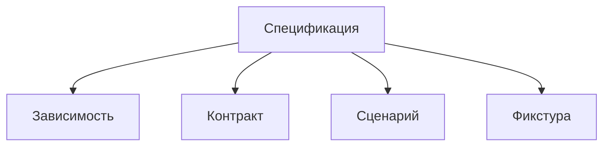

# Структура спецификации

Открывайте этот раздел, чтобы оформить проверяемые зависимости, контракты,
сценарии и фикстуры рядом с их непосредственным владельцем.

Проверки внутренних механизмов, включая интеграционные тесты, размещаются
отдельно в `test` пакета или сущности. Разделение определено в
[правилах структуры](../README.md#спецификации-и-тесты-реализации).

## Стандартная структура и параметризация

Структура спецификации задаётся стандартными средствами `bun:test`, включая
параметризацию групп через `describe.each`. Для отдельных тестов допустим
обычный `test`; `test.each` используется, когда нужна собственная параметризация.
Спецификации оформляются по единому стандарту, который определяет, какие данные
задаются на уровне группы, какие — на уровне теста и откуда извлекается каждое
значение для визуализации и MCP.

Параметры служат общим источником данных для исполнения проверок, визуализации
и MCP. Человек и агент получают одно и то же знание, выраженное в спецификации.
Структура групп, тестов и их параметров должна позволять извлекать эти данные
однозначно, без отдельных описаний для каждого представления.

Точный состав параметров и правила их извлечения предстоит определить
в спецификации этого стандарта.

## Положительные сценарии и негативные проверки

`scenario.spec.ts` и `scenario.spec.tsx` описывают положительные сценарии:
Storybook использует их для запуска и проверки ожидаемого успешного результата.
Негативные тесты в этих файлах не размещаются.

Проверки ожидаемых ошибок, некорректных входных данных и отказов оформляются
в отдельном файле `.spec.ts` или `.spec.tsx` того же владельца. Успешное
прохождение негативного теста подтверждает ожидаемый отказ, но не положительный
результат сценария, используемого Storybook.
