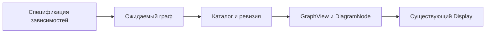

# Как показывать зависимости компонента

Заметка описывает путь от ожидаемого состава зависимостей в спецификации
до графа в Display. Ожидаемый граф сам по себе не доказывает, что проверка прошла.
Ожидаемый граф читается [обнаружением зависимостей](../../../../discovery/dependency-spec.ts).

```mermaid
flowchart LR
  spec["Спецификация зависимостей"] --> expected["Ожидаемый граф"]
  expected --> catalog["Каталог и ревизия"]
  catalog --> nodes["GraphView и DiagramNode"]
  nodes --> display["Существующий Display"]
```

## Откуда берутся данные

У пакета, а в переходной структуре — у обнаруженной директории, файл `spec/deps.spec.ts` добавляет представление зависимостей.
Его URL и возвращение к обзору определены в [контракте Панели вкладок](../../../../workbench/notes/workspace.md#tabs-routes);
JSON-декларация для обнаружения этого spec не нужна.

Discovery читает `test.each` через TypeScript AST без импорта spec и выполнения
тестов. Вариант содержит `{name, file, expected}`; `expected` — полный граф
`путь#компонент → {uses, elements}`. Неразрешённые ссылки и неверный формат
отклоняются. Это ожидаемый состав, а не свидетельство прохождения теста.
`read-parameterized-tests.ts` и проверки извлечения принадлежат Storybook.

## Когда обновляется граф

Источник и digest входят в каталог. Изменение, создание и удаление файла
учитываются при следующей явной проверке; действующая
ревизия сохраняется до успешного применения. Игнорируемые файлы и symlink
не подключаются. Представление зависимостей принадлежит той же физической
директории, что и spec.
Браузер получает данные графа из снимка ревизии, без исходного Bun-теста.

## Как граф появляется в Display

Представление лениво загружает общий GraphView и DiagramNode. Компоненты
и их нативные элементы показываются нодами; uses и elements задают связи.
DOM измеряет реальные ноды, @nodes/layout рассчитывает расположение и маршруты.
Граф монтируется в существующий Display и освобождается при смене содержимого.
Markdown, дополнительный Document, Canvas или Renderer не создаются.

## Масштаб и перемещение

Выбранный граф занимает доступную CSS-область Display. Общий GraphView измеряет
свой viewport после панели заголовка и «Вписать», первоначально показывает весь
граф и обслуживает pan/zoom без внешней прокрутки. Минимальный масштаб не мешает
вписыванию большого графа. При нескольких `test.each` cases выбор показывает
один case на всю оставшуюся область; смена case выполняет новый первичный fit.
До ручного pan/zoom изменение размера повторяет fit; после жеста сохраняются
положение и масштаб. Кнопка «Вписать» возвращает подгонку при resize.
Существующий общий ввод и semantic pointer capture завершают drag вне viewport.

Граф использования компонентов не подменяет дерево принадлежности пакетов.
Общий импорт не делает зависимость дочерней частью потребителя. Expected-граф
этого spec также не является автоматической классификацией Domain/Component.

## Зависимости контрактов и исполнение

Import type и export type показывают ответственность за форму данных. Input,
использующий Output другого пакета, выражает возможное соединение компонентов.
Эти сведения извлекаются из кода и native TypeScript символов, без второго
ручного реестра. Читатель Package сохраняет точный модуль и импортированные имена.

Граф контрактов, граф runtime-вызовов и физическое дерево принадлежности — разные
отношения. Общий тип не доказывает runtime-вызов; импорт через домен не меняет
владельца. Конкретный pipeline подтверждается композицией и её сценарием.
