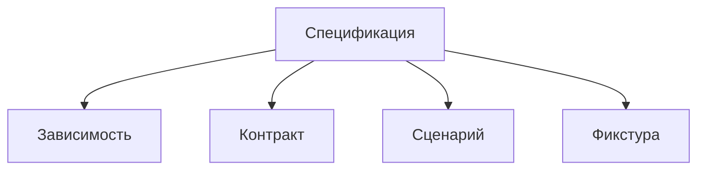

# Структура спецификации

Открывайте этот раздел, чтобы оформить проверяемые зависимости, контракты,
сценарии и фикстуры рядом с их непосредственным владельцем.

`readSpec({path})` находит непосредственную директорию `spec` владельца
и возвращает результат исполнения `scenario.spec.ts` либо `scenario.spec.tsx`
в поле `scenario`. Без директории возвращается `null`, без сценария —
`{scenario: null}`. Одновременное наличие обоих файлов считается ошибкой.
Чтение сценария выполняется существующим `readScenario` через Bun Test.

Проверки внутренних механизмов, включая интеграционные тесты, размещаются
отдельно в `test` пакета или сущности. Разделение определено в
[правилах структуры](../../notes/development.md#спецификации-и-тесты-реализации).

