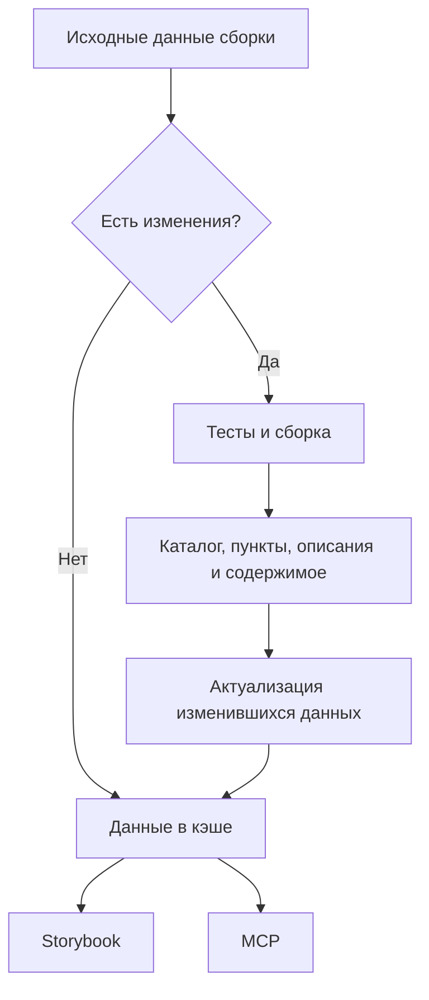

# Сборка и кэширование данных сценариев

Каталог вариантов, пункты, их описания и содержимое собираются из выполняемых
тестов во время сборки Storybook. Собранные данные сохраняются в кэше
и используются интерфейсом и MCP. Открытие пункта показывает подготовленные данные.

Если исходные данные сборки не изменились, используется кэшированный результат.
При изменениях выполняются тесты и сборка; после выполнения тестов полученные
данные актуализируются, если их содержимое изменилось.

Это согласованный цикл подготовки данных. Формат хранения и интеграцию
со сборкой ещё предстоит детализировать; схема не подтверждает готовность реализации.

Роли данных и их представление описаны в заметке
[Как сценарий задаёт каталог и содержимое](presentation.md).
