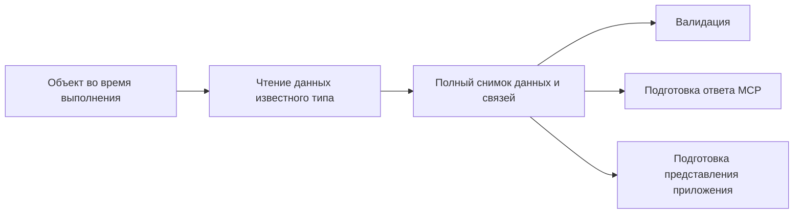

# Какие данные объектов пока не попадают в результат инспектора

Собственные перечисляемые поля не всегда содержат все данные объекта.
Например, записи Map, элементы Set и пиксели Bun.Image доступны через
специальные API. Текущий [сериализатор](../src/serialize.ts) эти API не использует.
Поэтому заполненный объект может попасть в результат как `{}`.

Эта заметка фиксирует проверенные находки и предложения к формату.
Обработчики перечисленных типов ещё не реализованы.

## Решение: отложить до конкретной потребности

Расширение сбора Map, Set, изображений и бинарных данных отложено до момента,
когда конкретной проверке действительно понадобятся отсутствующие сведения.
Само наличие объекта в результате не означает, что всё его внутреннее состояние
нужно сохранять. Перечень ниже служит материалом для будущего разбора,
а не утверждённым составом данных или планом реализации.

При возвращении к вопросу сначала определяем, что именно проверяется и каких
данных для этого не хватает. Затем выбираем необходимое представление и способ
его получения. До появления такой потребности дополнительные обработчики
не добавляем; текущую сериализацию по этому вопросу оставляем без изменений.

## Что обнаружено в действующих примерах

Проверены «Прямоугольник», «Овал» и «Круг» из
[сценария DiagramNode](../../../../../webxr-space/nodes/node/diagram/spec/scenario.spec.tsx).
В отдельном диагностическом запуске воспроизведены те же параметры и публичные
вызовы render и screenshot. Код компонентов и платформы не изменялся.

В дереве каждого варианта после отрисовки обнаружены семь Map и четыре Set.
Подсчёт включает обход содержимого этих коллекций, без повторного учёта общих объектов.

| Объект | Реальные данные | Что попадает в снимок сейчас |
| --- | --- | --- |
| Map атрибутов корневого элемента | Девять записей, включая атрибут формы | Пустой объект |
| Map обработчиков корневого элемента | Обработчик click | Пустой объект |
| Map скомпилированных стилей документа | Три записи | Пустой объект |
| Set подписчиков документа | По одному элементу в четырёх множествах | Пустой объект |
| Bun.Image, возвращённый screenshot | PNG размером 240 × 100 для прямоугольника и овала, 240 × 240 для круга | Пустой объект |

У всех этих Map, Set и изображений Object.keys возвращает пустой массив.
В частности, живой элемент возвращает rectangle, oval или circle через
getAttribute, но сериализация его Map атрибутов даёт `{}`.
Изображения успешно отдают metadata и кодированные байты через публичные методы,
хотя их сериализованное представление пустое.

Сами тесты компонента читают живые объекты и могут проходить.
Проблема относится к последующей валидации по результату инспектора:
из пустого объекта нельзя восстановить атрибуты или проверить изображение.

## Возможные данные для будущих проверок

| Тип | Предлагаемое содержимое | Что это даёт валидации |
| --- | --- | --- |
| Map | Тип коллекции, все пары ключ—значение в исходном порядке, ссылки на общие объекты | Проверка атрибутов, связей и содержимого коллекций; различение пустого Map и обычного объекта |
| Set | Тип коллекции, все элементы в исходном порядке, ссылки на общие объекты | Проверка состава и количества участников множества |
| Bun.Image | Метаданные и полное представление изображения без потери пикселей | Проверка размеров и содержимого изображения после завершения живого сценария |
| Uint8Array и Buffer | Тип, параметры представления и точные байты видимого диапазона | Проверка RGBA и PNG без превращения каждого байта в отдельное поле объекта |
| ArrayBuffer | Тип, длина и точные байты | Проверка переданного бинарного содержимого |

Тип коллекции нельзя выводить из того, пуста ли она. Map с нулём записей
всё равно отличается от `{}`. Ключами Map могут быть объекты, а не только строки;
превращать Map в обычный объект без сохранения типа ключей нельзя.

Общие ссылки и состояния разных моментов сохраняются по
[правилам снимка](value-format.md). Нельзя подменять полное изображение превью,
полную коллекцию — первыми элементами, а бинарное содержимое — одним размером или хешем.
Хеш может дополнять содержимое, но не заменяет его для произвольной валидации.

## Что требует отдельного решения

Bun.Image является цепочкой обработки изображения. Его bytes запускает эту
обработку и повторное кодирование. Для общего случая нужно определить момент
фиксации изображения и способ получить результат без изменения объекта вызывающего
кода. В проверенных сценариях используется PNG без дополнительных преобразований.
Одни metadata не заменяют изображение, а повторное кодирование исходного JPEG
нельзя автоматически считать сохранением пикселей без потерь.

Функции внутри Map и Set сейчас описываются именем. Состав регистраций можно
сохранить, но имя не восстанавливает тело функции или её замыкание.
Проверка личности обработчика также требует различать разные функции с одинаковыми именами.

Не вся скрытая информация является native-данными. Например,
[координаты DOMRect](../../../../../webxr-space/dom/geometry.ts) хранятся
в отдельном WeakMap. Произвольное чтение getters не подходит для универсального
снимка: оно может выполнять код. Для такого состояния нужен определённый
публичный способ получения данных у владельца или наблюдение результата API.

## Границы наблюдения

В проверенном дереве результата render и в screenshot непосредственно обнаружены
Map, Set и Bun.Image. Uint8Array и Buffer предусмотрены соседним методом capture
в [Headless](../../../../../webxr-space/headless/index.ts) и
[формате CapturedFrame](../../../../../webxr-space/headless/native-canvas.ts);
сам capture выбранные сценарии напрямую не вызывают. ArrayBuffer указан как
связанный бинарный тип, а не как обнаруженный результат этих трёх вариантов.

Приоритет типов заранее не выбран: порядок работы определит реальная потребность
проверок. Уменьшение повторов в существующем снимке само по себе перечисленные
данные не восстанавливает.
