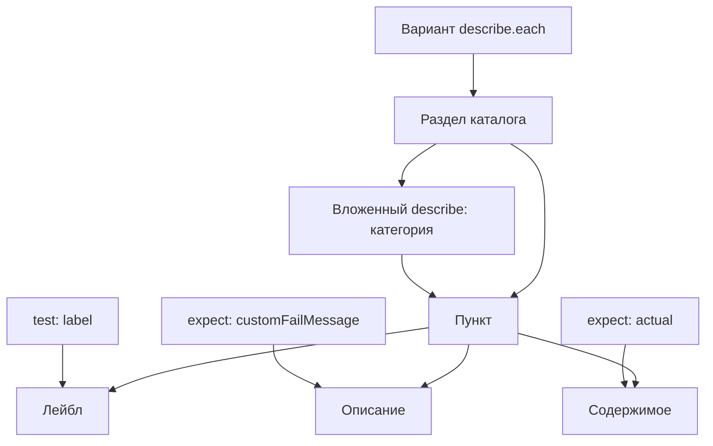

# Как сценарий задаёт каталог и содержимое

Эта заметка описывает только представление сценария в приложении и MCP.
Правила написания самих сценариев находятся в
[сценарии-руководстве](../spec/scenario.spec.ts).

## Граница ответственности автора

Автор, в том числе специализированный агент, пишет обычный сценарий на bun:test
и работает с публичным контрактом проверяемой функции или компонента.
Знание устройства Storybook, MCP и приложения для этого не требуется.
Эти сведения не входят в руководство по написанию сценариев и не должны
становиться обязательным контекстом автора.

Извлечение, кэширование и представление данных принадлежат потребителям сценария.
Они используют обычные describe, test и expect по согласованным правилам,
не требуя от автора отдельных деклараций для интерфейса или MCP.

## Соответствие элементов

| В сценарии | В представлении |
| --- | --- |
| Внешний `describe.each` | Варианты сценария в каталоге |
| Вложенный `describe` | Категория внутри варианта |
| `label` в `test` | Короткий лейбл пункта |
| `customFailMessage` в `expect` | Описание назначения данных |
| `actual` в `expect` | Содержимое пункта |
| Проверка после `expect` | Условие и результат соответствия данных контракту |

## Пример пункта

- Лейбл: «Путь сценария».
- Описание: «Файл сценария, которому принадлежит результат выполнения».
- Содержимое: фактический путь.

Описание показывается и при успешной проверке. При ошибке результат matcher
дополняет его конкретным несоответствием. Вложенные категории раскрывают
подкатегории и пункты; простые пункты могут находиться непосредственно в варианте.

## Что ещё предстоит определить

Приняты смысловые роли элементов. Точный формат извлечения данных,
визуальные компоненты и размещение описания внутри пункта ещё предстоит определить.
Само наличие сценария не подтверждает готовность представления в MCP и приложении.

Подготовка и обновление данных описаны отдельно:
[Сборка и кэширование данных сценариев](build-cache.md).
