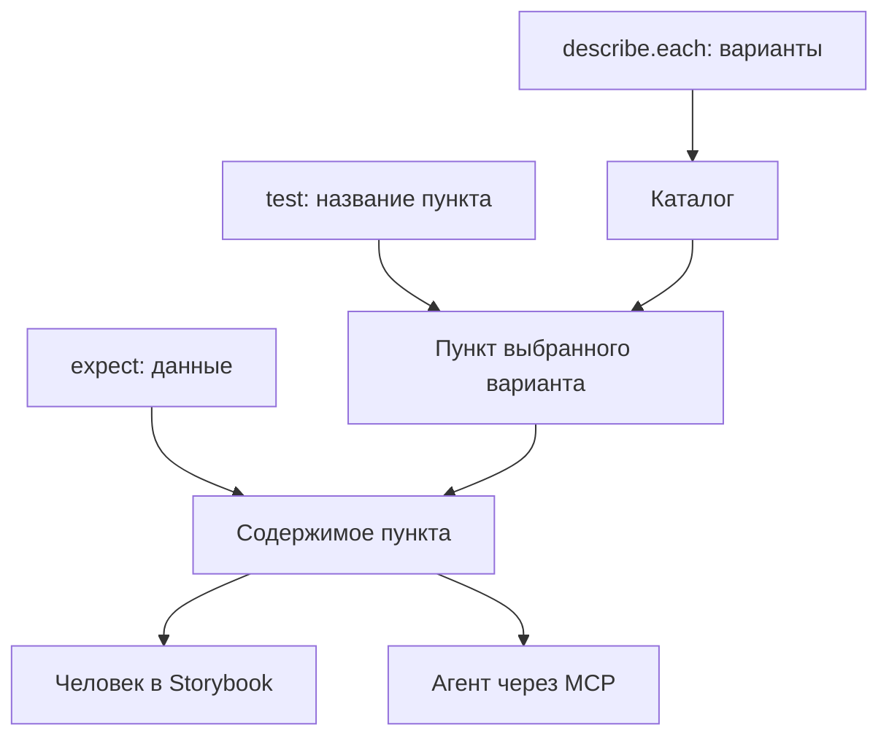
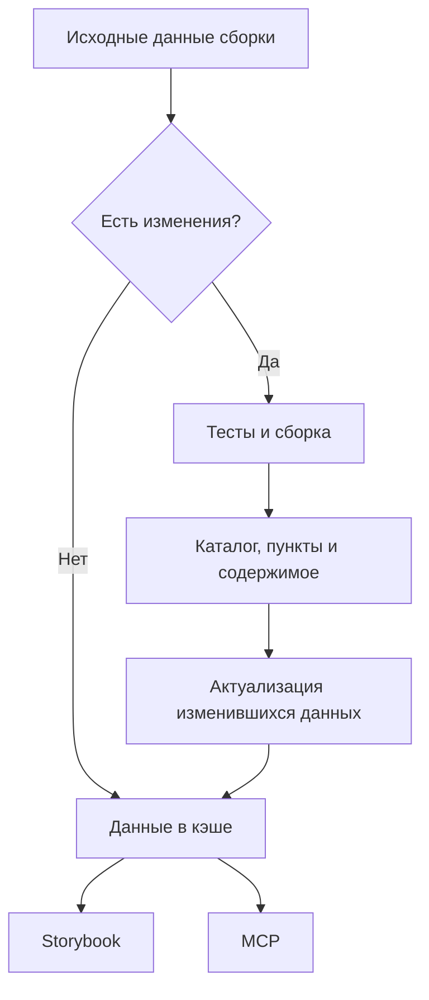

# Как сценарий задаёт каталог и содержимое

Сценарий одновременно проверяет поведение и задаёт его представление
в интерфейсе для человека и через MCP для агента. Его названия, параметризация
и данные должны быть понятны при просмотре результата без чтения исходного теста.

## Каталог, пункты и содержимое

- Параметризация `describe.each` задаёт каталог вариантов сценария.
- Тесты внутри варианта задают пункты этого каталога; название теста становится
  названием открываемого пункта.
- Данные, переданные в `expect`, составляют содержимое соответствующего пункта.
  Проверки описывают требования к этим данным.

## Названия пунктов

Название пункта обозначает содержимое, которое откроют человек и агент.
Например, «Ключи результата» открывает состав результата, а «Полный результат» —
весь полученный результат. Перечислять ключи в названии не нужно: они раскрываются
в содержимом. «Сохраняет полный результат» и «Соответствие результата снимку»
описывают работу проверки, поэтому не подходят для пункта с самим результатом.
Snapshot остаётся способом проверки и фиксации содержимого.

## Общий результат варианта

Проверяемая функция вызывается один раз внутри группы для её варианта.
Пункты раскрывают общий полученный результат и его части через отдельные тесты.
Сообщение ошибки передаётся непосредственно в `expect` и объясняет требование
к содержимому этого пункта; название варианта при необходимости встраивается
в предложение.

## Сборка и кэширование

Каталог вариантов, пункты и их содержимое собираются из выполняемых тестов
во время сборки Storybook. Собранные данные сохраняются в кэше и используются
интерфейсом и MCP. Открытие пункта показывает уже подготовленные данные.

Если исходные данные сборки не изменились, используется кэшированный результат.
При изменениях выполняются тесты и сборка; после выполнения тестов полученные
данные актуализируются, если их содержимое изменилось.

## Степень определённости

Это принятые принципы авторства, сборки и кэширования сценариев.
Точная структура извлечения и отображения
каталога, пунктов и содержимого ещё не определена; наличие сценария само по себе
не подтверждает, что всё это уже отображается в MCP или интерфейсе.

Пример разложения результата на пункты — [сценарий трассировки](../spec/scenario.spec.ts).
Имена и содержание пунктов ещё уточняются; пример не означает готовность
всего визуального представления.
