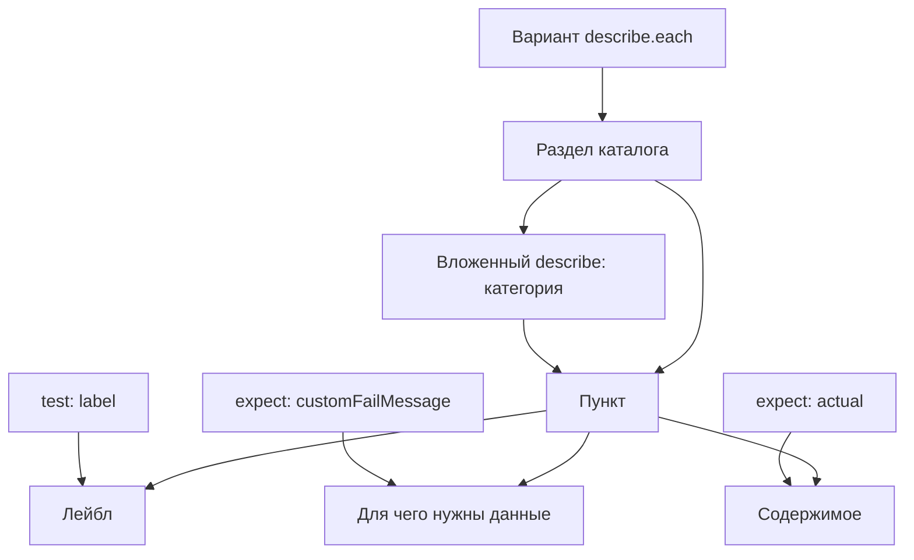

# Как сценарий задаёт каталог и содержимое

Сценарий задаёт представление данных для человека в Storybook и для агента
через MCP. Вариант образует раздел каталога, а каждый его тест — пункт
с коротким лейблом, описанием и содержимым.

Тесты здесь являются исполняемой документацией. Человек и агент узнают из них,
что возвращает код, для чего нужны эти данные и каким условиям они соответствуют.
Текст пункта остаётся полезным без чтения реализации проверки.

## Что за что отвечает

| В сценарии | В представлении |
| --- | --- |
| Внешний `describe.each` | Варианты сценария в каталоге |
| Вложенный `describe` | Категория внутри варианта |
| `label` в `test` | Короткий лейбл пункта |
| `customFailMessage` в `expect` | Краткое пояснение, для чего нужны данные пункта |
| `actual` в `expect` | Содержимое пункта |
| Проверка после `expect` | Условие, которому должны соответствовать данные |



## Категории внутри варианта

Внешний `describe.each` задаёт варианты сценария. Внутри каждого варианта
вложенные `describe` объединяют пункты в категории, когда это помогает
последовательно раскрыть данные. Категории могут содержать тесты и другие
категории; отдельная параметризация для категории не требуется.

Например, «Стандартный вывод» становится категорией с пунктом «Содержимое»,
а «Вызовы» — категорией с пунктами «Количество» и «Группы и результаты».
Простые пункты могут оставаться непосредственно внутри варианта.
Категории используют уже полученный результат варианта и не повторяют его запуск.

На каждом уровне описываемого контракта отдельный пункт «Ключи» показывает
полный состав полей через `toEqual` с ожидаемыми видами значений.
Группы и тесты задаются явно по смыслу контракта. Обход произвольного объекта
не создаёт тесты автоматически, а его фактические ключи не служат источником
ожидаемой формы: иначе проверка подстраивается под проверяемые данные.
Вложенные поля контракта раскрываются категориями, конечные значения — тестами.
У массива пункт «Состав» сохраняет порядок элементов; пустой массив тоже
имеет этот пункт. Строки и числа не получают выдуманных ключей объекта.
В [сценарии трассировки](../spec/scenario.spec.ts) это раскрытие заменяет
общий snapshot: отдельного пункта «Полный результат» там больше нет.

## Как выглядит пункт

Например, пункт результата чтения сценария:

- `label`: «Путь сценария».
- `customFailMessage`: «Файл сценария, которому принадлежит результат выполнения».
- `actual`: фактически полученный путь.

`customFailMessage` объясняет, для чего нужны данные и какое действие или понимание
они обеспечивают. При успехе это краткое описание назначения пункта; при ошибке
оно помогает понять, ради чего проверяемое условие должно выполняться.
Пересказ названия поля или самого сравнения не заменяет объяснения назначения.

## Описательная форма customFailMessage

`customFailMessage` отвечает на вопрос «Для чего это нужно?».
Если данные отсутствуют или неверны, то же описание объясняет, какое действие
или понимание из-за этого теряется. Конкретное несоответствие показывает matcher:
его ожидаемое и фактическое значения дополняют описание назначения.

Например, «Файл сценария, которому принадлежит результат выполнения»
объясняет назначение пути. При просмотре это описание пункта, а при ошибке —
объяснение, почему правильный путь важен.
Фраза «Путь должен совпадать с ожидаемым» лишь повторяет сравнение.

Назначение раскрывается самим описанием. Не нужно каждый раз пояснять его
оборотами «нужен для», «используется для», «позволяет» или «должно».
Например: «Итоги проверок и причины ошибок сценария» вместо
«Диагностический отчёт нужен для разбора итогов проверок и причин ошибок сценария».
Нужна конкретная связь данных с их использованием, а не единый словесный шаблон.
Общие фразы вроде «нужно для корректной работы» не раскрывают этой связи.
Описание не обещает свойств, которых проверка и данные не подтверждают.

```ts
test("Путь сценария", () => {
  expect(
    result.path,
    "Файл сценария, которому принадлежит результат выполнения",
  ).toBe(resolve(props.path))
})
```

## Лейблы и описания

`label` коротко называет открываемые данные: «Ключи результата», «Полный результат».
Ключи не перечисляются в лейбле — их видно в содержимом.
«Сохраняет полный результат» и «Соответствие результата снимку» описывают
механизм проверки, поэтому не подходят для пункта с самим результатом.
Snapshot используется временно, чтобы видеть полный результат, пока его данные
ещё разбираются и раскрываются отдельными проверками. После этого разбора
snapshot-проверки будут удалены; они не задают постоянный формат представления.

`customFailMessage` передаётся прямо вторым аргументом `expect`
и используется как описание пункта.
Название варианта при необходимости встраивается в предложение,
а не добавляется отдельным префиксом с двоеточием.

## Общий результат варианта

Проверяемая функция вызывается один раз внутри группы для её варианта.
Тесты раскрывают общий полученный результат и его части.
Пример такого разложения — [сценарий трассировки](../spec/scenario.spec.ts).

## Что ещё предстоит определить

Это принятые смысловые роли элементов сценария. Точный формат их извлечения,
визуальные компоненты и размещение описания внутри пункта ещё предстоит определить.
Наличие теста само по себе не подтверждает готовность представления в MCP и Storybook.

Когда данные собираются и обновляются, описано отдельно:
[Сборка и кэширование данных сценариев](build-cache.md).
