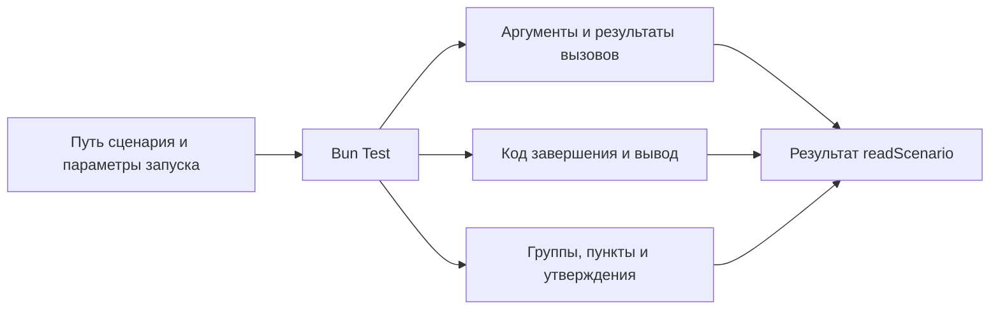

# Как получить данные выполненного сценария

[readScenario](../index.ts) читает структуру исходника, выполняет его настоящим
Bun Test и применяет правила архетипа. Результат содержит source со структурой
и фрагментами кода, данные одного выполнения и validation с результатами проверок.
К данным выполнения относятся путь, код завершения, оба потока вывода, история
вызовов, группы, пункты, утверждения и исходный JUnit этого же запуска.
Аргументы задаёт [входной контракт](../contract/input.ts), форму результата —
[выходной контракт](../contract/output.ts).

Это полные данные наблюдаемого выполнения для валидации, MCP и приложения.
Общие объекты внутри снимка сохраняются один раз и связаны ссылками;
точная семантика описана в [формате данных инспектора](value-format.md).

## Валидация

validation.checks содержит правило, его состояние и обнаруженные нарушения
с координатами исходника. passed означает прохождение реализованной проверки,
failed — найденные нарушения, not-checked — отсутствие достаточной проверки.
Общий статус incomplete сохраняет видимость незавершённых требований, даже если
все реализованные проверки прошли.

Проверяются нативные импорты, расположение файла, внешняя параметризация,
явная регистрация, размещение описаний, импорты mock/spyOn, пояснения пропусков,
наличие expect и исход Bun. Наблюдаемые вызовы вне test подтверждают только
наличие подготовки, а не полный поток данных. Публичность импортов, границы
фикстур, поток данных, освобождение всех ресурсов и смысловая полнота остаются
not-checked.

Нарушения оформления не уничтожают данные завершённого запуска. Ошибки чтения,
запуска и получения отчёта по-прежнему прерывают readScenario исключением.
Сценарий-руководство получает структуру и валидацию через тот же публичный вызов;
production-код не импортирует его фикстуры.

## Что передаёт вызывающий код

Обязателен путь к файлу. Необязательные env задают окружение дочернего процесса,
testNamePattern выбирает тесты штатным фильтром Bun. Подготовка внутри describe
может выполняться и у вариантов, тесты которых отфильтрованы.

Публичный вход экспортирует readScenario и два основных контракта.
Вспомогательные типы частей результата остаются внутренними и выводятся
из выходного контракта в [src/types.ts](../src/types.ts).
Отдельного параллельного API чтения нет.

При вызове из другого пакета file-зависимость может разрешаться в установленную
копию исходников. После изменения инспектора обновляется именно эта зависимость;
совпадение версии package.json не доказывает совпадение кода. Проверять нужно
публичный импорт потребителя, а не подменять его прямым путём во внутренний src.
Перезапуск MCP-прокси не обновляет установленную копию пакета.

## Как определяется среда

Сборщик читает импорты исполняемого кода и ближайший package.json.
Рабочей директорией становится директория этого пакета.
Preload берётся из bunfig.toml и подходящей команды bun test в scripts.test.
Поддержаны явные пути и директории; shell-команды, glob и подстановки shell
не исполняются. JSX transport определяется по публичному jsx-runtime export
пакета preload. Неоднозначная конфигурация даёт ошибку.

## Что можно наблюдать

Автоматически наблюдаются функции импортированных прикладных модулей
и собственные изменяемые методы возвращённых объектов.
Встроенные модули Bun и Node исключены. Обёртки сохраняют this и Promise;
исходники сценария и компонента на диске не меняются.

Immutable методы, constructors, динамические импорты и скрытое состояние
native объектов пока не поддержаны. Детали подготовки среды находятся
в [discover](../src/discover.ts), запуск и получение отчёта —
в [trace](../src/trace.ts).
