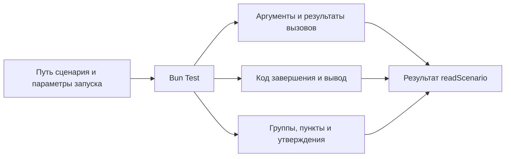

# Как получить данные выполненного сценария

[readScenario](../index.ts) запускает файл сценария настоящим Bun Test и возвращает
данные его выполнения: путь, код завершения, оба потока вывода, историю вызовов,
группы, пункты, утверждения и исходный JUnit этого же запуска.
Аргументы задаёт [входной контракт](../contract/input.ts), форму результата —
[выходной контракт](../contract/output.ts).

Это полные данные наблюдаемого выполнения для валидации, MCP и приложения.
Общие объекты внутри снимка сохраняются один раз и связаны ссылками;
точная семантика описана в [формате данных инспектора](value-format.md).

## Что передаёт вызывающий код

Обязателен путь к файлу. Необязательные env задают окружение дочернего процесса,
testNamePattern выбирает тесты штатным фильтром Bun. Подготовка внутри describe
может выполняться и у вариантов, тесты которых отфильтрованы.

Публичный вход экспортирует readScenario и два основных контракта.
Вспомогательные типы частей результата остаются внутренними и выводятся
из выходного контракта в [src/types.ts](../src/types.ts).
Отдельного параллельного API чтения нет.

## Как определяется среда

Сборщик читает импорты исполняемого кода и ближайший package.json.
Рабочей директорией становится директория этого пакета.
Preload берётся из bunfig.toml и подходящей команды bun test в scripts.test.
Поддержаны явные пути и директории; shell-команды, glob и подстановки shell
не исполняются. JSX transport определяется по публичному jsx-runtime export
пакета preload. Неоднозначная конфигурация даёт ошибку.

## Что можно наблюдать

Автоматически наблюдаются функции импортированных прикладных модулей
и собственные изменяемые методы возвращённых объектов.
Встроенные модули Bun и Node исключены. Обёртки сохраняют this и Promise;
исходники сценария и компонента на диске не меняются.

Immutable методы, constructors, динамические импорты и скрытое состояние
native объектов пока не поддержаны. Детали подготовки среды находятся
в [discover](../src/discover.ts), запуск и получение отчёта —
в [trace](../src/trace.ts).
