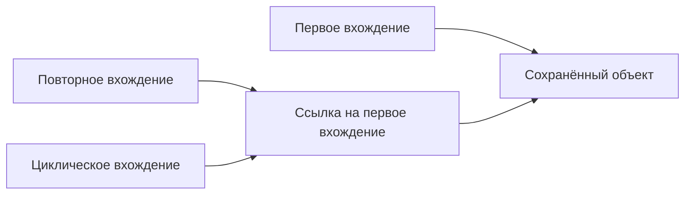

# Полные данные инспектора и ссылки на общие объекты

[Результат readScenario](../contract/output.ts) является общим источником
для валидации, MCP и приложения. В нём сохраняются вызовы, аргументы, исходы,
контекст, координаты и оба потока вывода. Очистка и представление для MCP
или интерфейса выполняются поверх этих данных.

## Один объект внутри одного снимка

При первом появлении объекта [сериализатор](../src/serialize.ts) записывает
его данные. При повторном появлении того же объекта записывает ссылку на
первое вхождение. Так сохраняются и содержимое, и факт общей ссылки.
Разные объекты с одинаковыми полями не объединяются.



Например, если два аргумента ссылаются на один объект:

```json
[
  {"value": 7},
  {"$type": "reference", "path": [0]}
]
```

Данные второго аргумента доступны по ссылке. Это не пропущенное значение.
Валидация разрешает ссылку при чтении содержимого и может отдельно проверять,
что аргументы ссылаются на один объект.

## Путь ссылки

path — массив ключей объектов и числовых индексов массивов. Путь разрешается
последовательно от корня закодированного снимка. Пустой массив означает корень.
Например, [0, "a.b", ""] обозначает первый аргумент, его поле с буквальным
именем a.b и вложенное поле с пустым именем. Точки, скобки и кавычки в ключах
не требуют разбора строки пути. Каждый сегмент указывает на собственное поле
сохранённого объекта или элемент массива, без обращения к прототипу.

Корень ссылки зависит от места данных: весь массив args, значение outcome.value
либо ошибка outcome.error. Ссылка не переходит в другой вызов или другой снимок.
Это единый формат ссылок на циклы и повторения; прежняя строковая запись пути
больше не формируется.

## Состояние во времени

Каждый вызов serialize создаёт отдельную таблицу ссылок. Поэтому изменение
объекта между вызовами сохраняется в следующем снимке, а предыдущий не меняется.
Обычные свойства аргументов читаются до передачи управления вызванной функции.

Содержимое Promise становится доступно позже. Для его результата используется
отдельная таблица повторов с сохранением ссылок на внешних предков для циклов.
Поздний результат не заменяется ранним состоянием объекта из соседней ветви.
Сам Promise при повторном появлении в одном снимке остаётся общей ссылкой.

## Пользовательское поле $type

Служебные метки не смешиваются с объектами пользователя. Если у исходного
объекта есть собственное перечисляемое поле $type, его поля помещаются в
обёртку {$type: "object", value: {...}}. Это сохраняет исходные имена и данные,
включая объекты, похожие на служебную ссылку.

Путь ссылки указывает на закодированные данные, поэтому учитывает value
экранирующей обёртки. При восстановлении обёртка снимается.

## Проверка сохранности

[Проверки сериализации](../test/serialize.test.ts) восстанавливают данные и связи:
общие объекты, разные равные объекты, циклы, необычные имена полей,
пользовательские метки и изменения между снимками и завершениями Promise.

Сериализатор по-прежнему читает собственные перечисляемые свойства и не вызывает
getters. Функции, ошибки и другие специальные значения имеют описательные метки;
скрытое состояние native объектов не извлекается. Например, ошибка сейчас
содержит имя и сообщение, а не всё состояние Error. Сохранность относится
к данным этого наблюдаемого контракта; полноту наблюдения специальных объектов
нужно оценивать отдельно.

Найденные потери и данные, необходимые для валидации, разобраны в
[заметке о специальных объектах](native-values.md).
