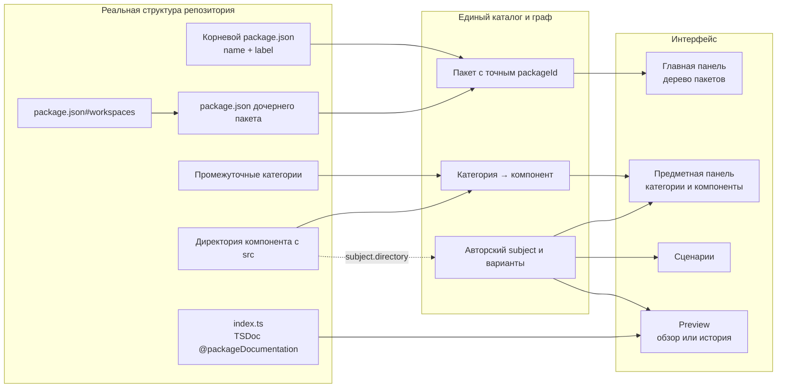

# Что Storybook берёт из структуры и куда помещает

Корень репозитория и самостоятельный пакет используют авторский обзор
`README.md` рядом с `package.json`. Стандартный файл обнаруживается и при
наличии манифеста; явный `manifest.readme` сохраняет приоритет. Если обзора
пока нет, узел остаётся видимым. Содержание README принадлежит авторам пакета.
Обычная директория, категория и компонент используют TSDoc своего `index.ts`.

## От файлов на диске до панелей Storybook



`package.json` задаёт независимое владение. Внутри пакета обнаружение проходит
через промежуточные категории до директории с собственным `src/`.
Эта директория становится модулем; её реализация и внутренние компоненты
дальше не обходятся. `exports` и re-exports не определяют роль директории.
Публичный API указывает на настоящие исходники независимо от навигации.

## Пример Nodes и числового параметра

```text
webxr-space/
├─ package.json                  @zavx0z/webxr
└─ nodes/
   ├─ package.json               @webxr/nodes
   ├─ node/
   │  ├─ index.ts                TSDoc компонента Node
   │  └─ src/node.tsx            реализация; обход здесь остановлен
   ├─ tree/package.json          @nodes/tree
   ├─ layout/package.json        @nodes/layout
   ├─ sockets/package.json       @nodes/sockets
   └─ parameters/
      ├─ package.json            @nodes/parameters
      ├─ README.md               авторский обзор пакета
      ├─ index.ts                модульный TSDoc
      └─ numeric/
         ├─ index.ts             TSDoc категории
         └─ number/
            ├─ index.ts          TSDoc компонента
            ├─ src/number.tsx    реализация; обход здесь остановлен
            └─ tests/            проверки компонента
```

Главная панель показывает `WebXR → Нодовая система → Параметры` по настоящим
package roots. Предметная панель пакета `@nodes/parameters` раскрывает
`numeric → number`. У структурного пути адрес
`/pkg-nodes-parameters/dir-numeric/dir-number`: каждый сегмент имеет свой
префикс `dir-`. Произвольные смешанные directory/story маршруты отклоняются.

## Как существующие сценарии связываются со структурой

Каталог может указать `"directory": "numeric/number"` у subject.
Путь разрешается относительно корня его пакета и должен обозначать уже
обнаруженный модуль с `src/`. Категория, скрытая директория, отсутствующий
модуль или путь за границей пакета не подходят.

При одном subject строка `number` показывает сценарии этого subject,
использует имя директории и её TSDoc. Отдельного дубля компонента не возникает.
Объявленные subject/variant routes, API identity и presentation сохраняются,
например `parameters/number/field`.

Несколько subjects одного модуля остаются дочерними строками его директории.
Так 19 preset-представлений Socket могут принадлежать одному `socket/src`.
Набор presets не становится набором новых компонентов или пакетов.
Опустевшая прежняя JSON-категория убирается из навигации после переноса её
привязанных subjects. Subjects без `directory` сохраняют прежнее размещение.

## Итоговое размещение

```text
ГЛАВНАЯ ПАНЕЛЬ
└─ корневой пакет                ← выбранный путь + package.json#name
   └─ дочерний пакет             ← workspaces + package.json#name

ПРЕДМЕТНАЯ ПАНЕЛЬ ВЫБРАННОГО ПАКЕТА
├─ категория                     ← промежуточная директория
│  └─ компонент                  ← директория с src
│     └─ представления           ← несколько привязанных subjects, если есть
└─ непривязанная JSON-категория
   └─ subject

ПАНЕЛЬ СЦЕНАРИЕВ
└─ варианты subject              ← catalog.json; исходные routes

ЦЕНТРАЛЬНАЯ ОБЛАСТЬ
├─ TSDoc index.ts                ← категория или компонент
├─ README пакета                 ← авторский пакетный обзор
└─ исполняемая история           ← module.path + module.export
```

`src`, `shared`, `.git`, `node_modules`, `.storybook`, `tests`, `test`
и исключённые Git пути скрыты на каждой глубине. Git ignore semantics
учитывают вложенные `.gitignore` и правила с `!`; имена `build` и `dist`
сами по себе ничего не исключают. Symlink-директории не обходятся.
Директория с `package.json` не дублируется как обычная папка и останавливает
обход; состав пакетов задаётся workspaces или согласованной manifest-композицией.
Пустые директории и узлы без документации остаются видимыми.

Обзор директории читается только из начального `@packageDocumentation`
её `index.ts`, без исполнения TypeScript и без README fallback.
Корневой `index.ts` также содержит модульный TSDoc; это не подменяет README
как пакетный обзор. Извлечение публичных объявлений и тестов в API, сценарии
или Inspector не выводится автоматически из exports.

Структура, декларации, поиск, UI и MCP используют один нормализованный граф.
Описание и ресурсы попадают в immutable revision; пользовательские вкладки
получают изменения после успешной сборки и применения. Родительская
вложенность не объединяет сборки, Stores, ревизии или runtime дочерних пакетов.
