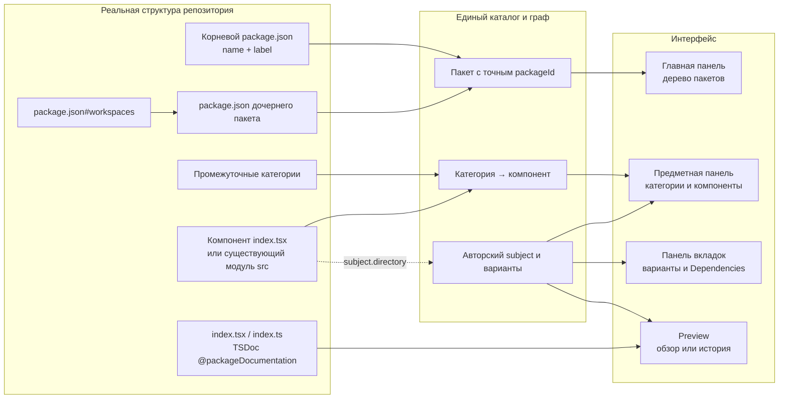

# Что Storybook берёт из структуры и куда помещает

Этот guide иллюстрирует путь данных от файлов до панелей. Единственный
нормативный источник — [правила структуры в requirements.md](../requirements.md#structure-contract);
здесь приведены схема и примеры, а не отдельный набор правил.

## От файлов на диске до панелей Storybook



В этой схеме discovery передаёт сведения о пакетах, каталогах и документации
в нормализованный граф. UI и MCP проецируют этот же результат; package exports
остаются отдельным описанием API. Точные границы обхода заданы в
[контракте каталогов и компонентов](../requirements.md#component-placement).

## Пример Nodes и числового параметра

Это пример размещения с именами пакетов Nodes, а не полный снимок репозитория.
Частный вычислительный helper показан как необязательный файл.

```text
webxr-space/
├─ package.json                  @zavx0z/webxr
└─ nodes/
   ├─ package.json               @webxr/nodes
   ├─ node/
   │  ├─ package.json            @nodes/node
   │  ├─ README.md               обзор пакета
   │  ├─ shared/                 код нескольких компонентов пакета
   │  └─ diagram/index.tsx       компонент/композиция и TSDoc
   ├─ tree/package.json          @nodes/tree
   ├─ layout/package.json        @nodes/layout
   ├─ sockets/package.json       @nodes/sockets
   └─ parameters/
      ├─ package.json            @nodes/parameters
      ├─ README.md               обзор пакета
      ├─ index.ts                модульный TSDoc
      ├─ shared/                 общие помощники пакета
      └─ numeric/
         ├─ index.ts             TSDoc категории
         └─ number/
            ├─ index.tsx         компонент и TSDoc
            ├─ src/compute.ts    частные вычисления компонента
            ├─ types/            вспомогательные типы
            ├─ contract/input.ts входной контракт и его TSDoc
            └─ tests/            проверки компонента
```

В примере главная панель показывает `WebXR → Нодовая система → Параметры`,
а предметная панель `@nodes/parameters` — `numeric → number`. До привязки subject
структурный обзор number имеет адрес `/pkg-nodes-parameters/dir-numeric/dir-number`.
Если у него обнаружен dependency spec, представление Dependencies получает
конечный `/dependencies` по [единому контракту URL](../requirements.md#tabs-routes).

## Как существующие сценарии связываются со структурой

Пример привязки: `"directory": "numeric/number"` у authored subject.
Она связывает сценарии с уже обнаруженным модулем из примера. Строка number
может показывать авторские варианты, сохраняя их адреса, например
`parameters/number/field`, без дублирования компонента.

Несколько preset-представлений Socket иллюстрируют другой случай: разные views
относятся к одному модулю, не становятся самостоятельными компонентами или
пакетами. Нормативные правила one/many bindings и удаления опустевшей категории
находятся в [контракте subject.directory](../requirements.md#component-placement).

## Итоговое размещение

```text
ГЛАВНАЯ ПАНЕЛЬ
└─ корневой пакет                ← выбранный путь + package.json#name
   └─ дочерний пакет             ← workspaces + package.json#name

ПРЕДМЕТНАЯ ПАНЕЛЬ ВЫБРАННОГО ПАКЕТА
├─ категория                     ← промежуточная директория
│  └─ компонент                  ← каталог с index.tsx
│     └─ представления           ← несколько привязанных subjects, если есть
└─ непривязанная JSON-категория
   └─ subject

ПАНЕЛЬ ВКЛАДОК
├─ варианты subject              ← catalog.json; исходные routes
└─ Dependencies                  ← найденный spec; собственный route

ЦЕНТРАЛЬНАЯ ОБЛАСТЬ
├─ TSDoc index.tsx / index.ts    ← компонент или категория
├─ README пакета                 ← авторский пакетный обзор
└─ исполняемая история           ← module.path + module.export
```

Источники документации, исключения и правила package/module boundaries
не повторяются здесь: см. [нормативный раздел](../requirements.md#structure-contract).
Обзор открывается кликом по предмету, а адресуемые вкладки — по
[контракту Панели вкладок](../requirements.md#tabs-routes).

Структура, декларации, поиск, UI и MCP используют один нормализованный граф.
Описание и ресурсы попадают в immutable revision; пользовательские вкладки
получают изменения после успешной сборки и применения. Родительская
вложенность не объединяет сборки, Stores, ревизии или runtime дочерних пакетов.
