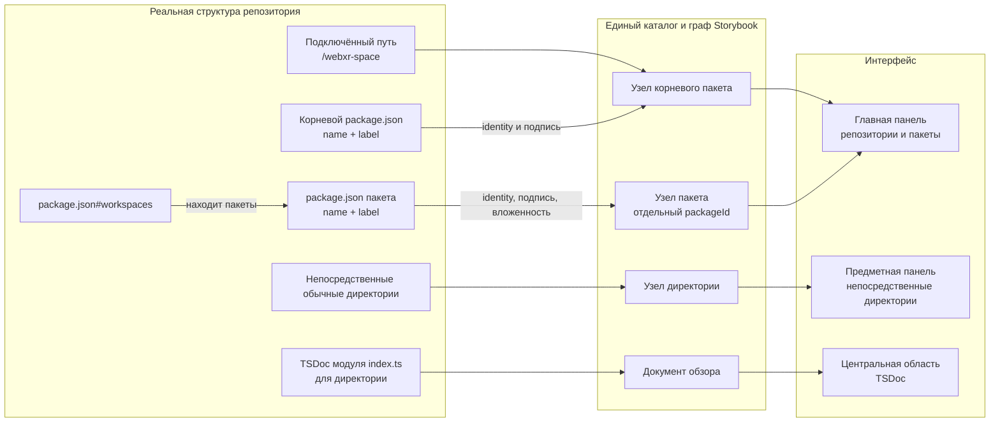
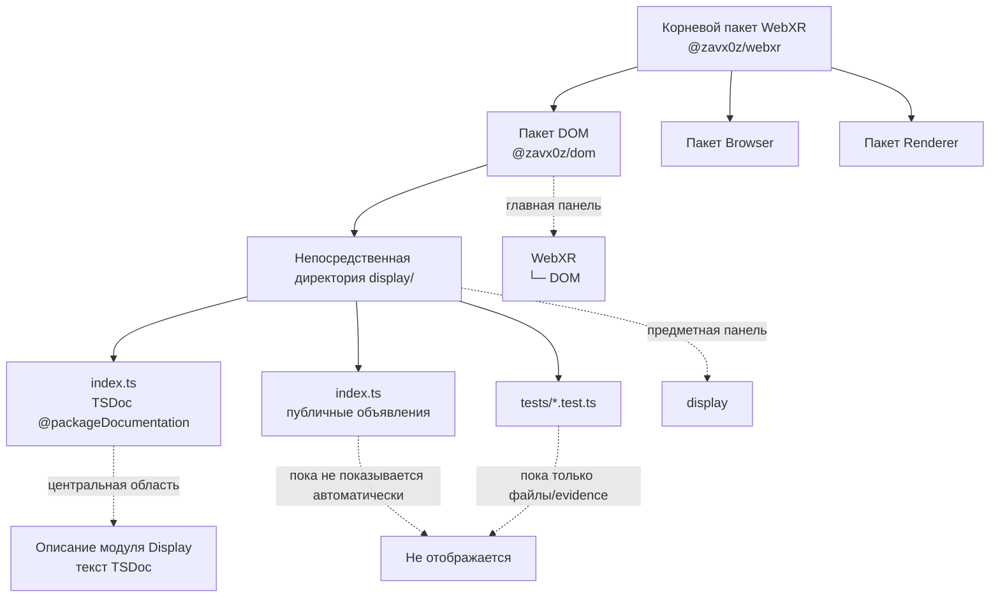
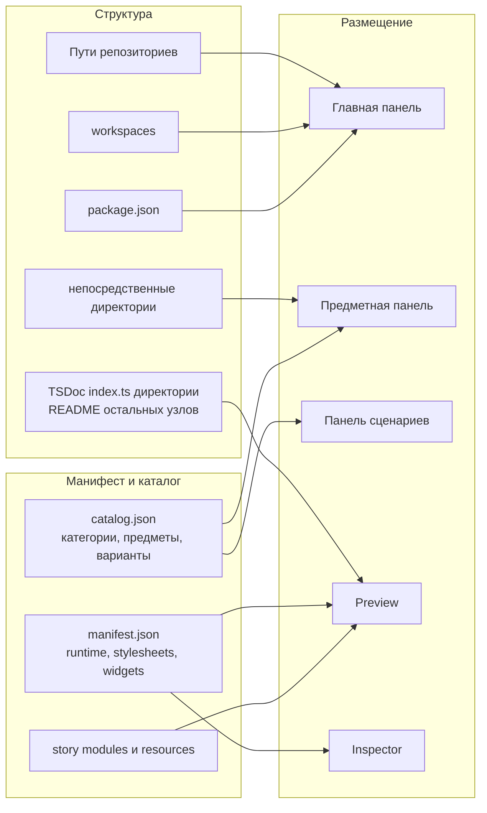

# Что Storybook берёт из структуры и куда помещает

Репозиторий и самостоятельный пакет имеют обязательный авторский обзор
в `README.md` рядом с `package.json`. Стандартный файл обнаруживается и при
наличии манифеста; явный `manifest.readme` сохраняет приоритет. Если обзора
пока нет, узел остаётся видимым. Обычная директория использует TSDoc `index.ts`.

## От файлов на диске до панелей Storybook



## Пример `webxr-space/dom/display`



## Структурный и описательный слои



## Итоговое размещение

```text
ГЛАВНАЯ ПАНЕЛЬ
└─ корневой пакет                    ← подключённый путь + package.json#name
   └─ вложенный пакет                ← workspaces + package.json#name
      └─ вложенный пакет             ← физическая вложенность package roots

ПРЕДМЕТНАЯ ПАНЕЛЬ ВЫБРАННОГО ПАКЕТА
├─ непосредственная директория       ← структура
└─ категория catalog.json            ← описание
   └─ предмет                        ← описание

ПАНЕЛЬ СЦЕНАРИЕВ
└─ варианты предмета                 ← catalog.json

ЦЕНТРАЛЬНАЯ ОБЛАСТЬ
├─ TSDoc index.ts директории         ← структура
├─ README остальных узлов            ← действующий контракт обзора
└─ исполняемая история               ← manifest + catalog.json
```

Корень репозитория представлен одним пакетом с identity = package.json#name. Пакеты без
`.storybook/manifest.json` также отображаются. Директория с `package.json` не
дублируется как обычная директория, а обнаружение директорий не пересекает
границу пакета.

В предметной панели показываются только непосредственные директории выбранного
репозитория или пакета. `src`, `.git`, `node_modules`, `.storybook`, `tests`,
`test` и исключённые Git пути не отображаются. Публичный URL пакета использует
форму `/pkg-scope-name`, а непосредственная директория — один сегмент
`/dir-name`.

Обзор директории берётся только из начального блока `@packageDocumentation`
её `index.ts`, без исполнения кода. README.md сохраняется на диске, но не
используется как источник или fallback для директории. При отсутствии описания
директория остаётся видимой с явным сообщением. Изменения описания пакета
попадают в пользовательские вкладки после сборки и применения ревизии.

Структура уже находит `dom/display` и показывает модульный TSDoc. Извлечение
публичных объявлений, тестов и будущих story-файлов в API, сценарии и
Inspector-разделы остаётся следующим этапом.
