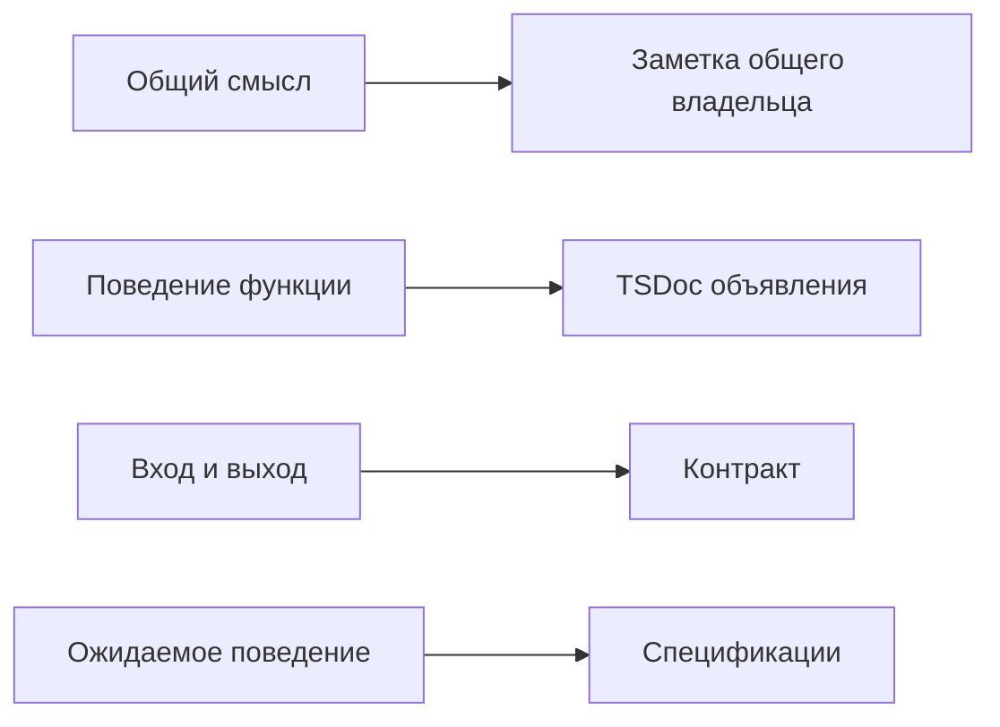

# Как описывать поведение и ответственность в коде

Заметка помогает выбрать место для объяснения: общий смысл — у владельца системы,
поведение функции — рядом с её объявлением, форма данных — у контракта.
Ниже сохранены подробные правила оформления. README указывает на заметки;
смысл, доступный MCP и Storybook, переносится в код, контракты, TSDoc и spec.

Этот раздел владеет общими правилами документации проектов, пакетов и предметов,
показываемых в Storybook. Он адаптирует стандарт MetaFor к существующим владельцам
Storybook. README, навыки и примеры ссылаются на него, не создавая копий норм.
Правила обнаружения обзоров, структуры, контрактов и применения ревизий сохраняют
своих владельцев. Наличие документа не доказывает соответствие его содержания
стандарту: discovery не выполняет смысловую приёмку текста.

#### Владельцы информации

Документация образует связанную систему: каждый общий факт имеет одного владельца.
Общий смысл системы, жизненный цикл, границы и карта ответственности принадлежат
коду и контрактам общего владельца; неперенесённое содержание временно остаётся
в его заметках. Назначение README пакета описано в правиле обзора.
README указывает на заметки своего владельца и не повторяет их содержание.
Существующая карта документов сохраняется;
введение стандарта само по себе не создаёт новую директорию документации.

Обзор пакета принадлежит модульному TSDoc его публичного входа.
Для Domain со средовыми входами описание каждого относится к соответствующей
реализации и протоколу; общий index для документации не создаётся.
Текущие читатели ещё выбирают только index.tsx/index.ts —
этот разрыв сохраняется явно.
Обзоры обычных директорий пока сохраняются в переходной проекции. Технические сведения
принадлежат TSDoc существующего кода и типов. Команды запуска, диагностики и
проверок принадлежат руководству разработки. История решений, состояние задач,
снимки, измерения и результаты прогонов остаются в Git, задачах и артефактах.
Перенос сведений сохраняет уникальную информацию и её контекстные связи.

#### Смысловой текст

Текст у соответствующего владельца объясняет, что существует и зачем, какое
событие начинает работу, кто принимает решение, какой результат наблюдается и
где начинается следующая ответственность. Принятый закон выражается через
действующие понятия и допустимые действия. Неперенесённый смысл сохраняется в
заметке; README даёт ссылку на неё, но не становится источником MCP.

В обзорном тексте не перечисляются внутренние файлы, поля DTO, generic-параметры,
детали кэшей, служебные маркеры, URL query, точные сообщения, порты, версии
инструментов, команды, тайминги и число пройденных тестов. Эти сведения сохраняются
в TSDoc, руководстве разработки, тестах или свидетельствах задачи по ответственности.
Архитектурный документ может описывать принятый целевой закон; TSDoc описывает
только реально существующий код и его фактическое поведение.

Авторский текст пишется по-русски; точные имена кода и протоколов сохраняются.
Один термин сохраняет одно значение в согласованной модели. Первое полное
scoped-имя пакета вводит
короткое имя в том же предложении; последующие упоминания используют это имя.
Namespace обозначает множество пакетов. Документ окружения содержит самостоятельный
текст без гиперссылок и машинных адресов. Подробности выделяются в части у того же
владельца. Их состав объявляется в Env и раскрывается вложенными запросами через
children ответа среды. Агент использует адреса относительно назначенного предмета.
Документы и их тексты не копируются между владельцами.

#### TSDoc объявлений кода

Правила комментариев принадлежат TypeDoc.
Сценарий проверяет документацию переданных
исходников; заметка владельца сохраняет
неперенесённые смысловые требования и границы автоматической проверки.

#### Проверка документационной правки

Перед правкой сверяются действующие документы-владельцы, код, публичные типы,
exports, тесты и существенная история. Чисто документационный diff меняет только
тексты Markdown, содержимое TSDoc или текст навыков: без исполняемых tokens,
сигнатур, manifests, runtime, build и test code. Для него достаточно чтения
полного diff, Markdown/TSDoc parsing, проверки ссылок и anchors и diff-check.
Он сам по себе не требует typecheck, тестов, сборки, смены версии, публикации
артефактов или перезапуска процессов. Смешанный diff проверяется по всем
затронутым исполняемым контрактам и не получает этого исключения.

Явная задача показать или применить обновлённую документацию в Storybook проходит
существующий MCP-процесс проверки кандидата и применения ревизии. Изменение текста
не отменяет этот процесс и не разрешает обходить его. Проверка структуры и парсинга
подтверждает только проверенное свойство; смысловая и визуальная приёмка остаются
отдельными действиями. Спорное изменение действующего требования согласуется
с пользователем до правки, остальные требования сохраняются.
