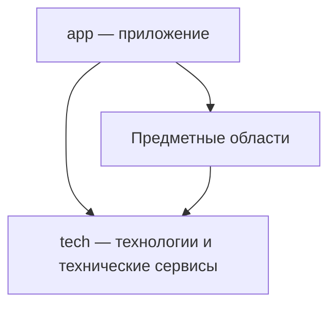

# Предметная архитектура проекта

Архитектурный стиль организации кода, ответственности и зависимостей проекта
опирается на [Основания](../../project/notes/foundations/index.md).
Предметные сущности выражают смысл системы; технологии обеспечивают их
реализацию; приложение соединяет подготовленные возможности.

Эта заметка — временный единый источник согласованных принципов на время
формирования архитектуры Storybook. Правила уточняются здесь, чтобы сохранять
одно место правок до их раскрытия агентам через MCP. Текущая реализация и её
границы описаны в [архитектуре Storybook](../../ARCHITECTURE.md);
наличие целевого правила ещё не означает завершённую миграцию.

Для Storybook согласован верхний уровень: `project`, `repo`, `package`,
`domain`, `cluster`, `component`, `container`, `contracts`, `typedoc`, `specs`, `tech` и `app`. Предметные области получают
самостоятельных владельцев в корне; общий контейнер `archetypes` расформируется.
Каталог и ревизии не вводятся отдельными корневыми предметными областями:
предметные операции переходят к своим владельцам, общая композиция — в `app`,
а чисто технические механизмы — в `tech`.

Миграция выполняется согласованными порциями с проверками и коммитом
после завершённого этапа; push требует отдельного прямого поручения.
Для контура сборки и HMR сначала обеспечивается работоспособный механизм
подготовки и обновления, на котором можно проверять последующий перенос.
Его самостоятельные возможности оформляются по Архетипам и проверяются
на малых сценариях, затем соединяются в работающую цепочку приложения.
Дальнейшая структурная миграция использует эту цепочку и сохраняет поведение.
Исторические имена пакетов сами по себе не определяют физическую принадлежность;
изменение identity не требуется только из-за перемещения её единственного владельца.

## Сборка и обновление Storybook

Следующие положения задают целевое поведение; пустые пакеты `app` и существующий
механизм обновления ещё не подтверждают его реализацию.

`app` — Container, лаунчер и оркестратор собственных частей `mcp`, `web` и `server`.
Он управляет запуском, состоянием, завершением и версиями статичных частей.
Его публичный контракт оформляется по [правилам Contracts](../../contracts/notes/draft-contracts.md).
Управляющие MCP-вызовы обслуживаются в `app/src/mcp.ts`; предметные lazy-вызовы —
в `app/mcp`. Запуск без MCP использует тот же API через поле `scripts`
в `package.json`, без отдельного CLI-компонента или новой директории запуска.

`tech` предоставляет обслуживание приложения и его частей: компиляцию,
процессы, хранение артефактов, MCP-транспорт и HMR. Вложенные
`app/{mcp,web,server}/build` выражают встроенные динамические возможности частей;
они не являются механизмом выпуска их статичной поставки.

Различаются три повода для подготовки исполняемого кода:

- Перевыпуск статичной среды и выбранных частей приложения — явная управляющая
  операция `app`. Готовая поставка используется при обычном запуске.
- Пересборка собственного Web-интерфейса — отдельная явная операция. В стабильной
  поставке Minimap, Workbench и остальные представления уже собраны. При разработке
  интерфейса операция использует готовую совместимую среду, не пересобирая её,
  Server и MCP. Несовместимость требует отдельного явного обновления среды.
- Подготовка компонента или сценария подключённого проекта — предметная операция
  владельца. Она использует готовую среду и не пересобирает интерфейс Storybook.

В Minimap находится кнопка пересборки Web-интерфейса. По прямому поручению
пользователя агент вызывает ту же операцию через управляющий API `app`.
Оба входа используют одну подготовку результата и его применение через HMR.
Работа агента над компонентом, открытие представления и подключение клиента
сами по себе не запускают перевыпуск статичной среды или Web-интерфейса.
Завершённые изменения через предметные инструменты могут явно инициировать
подготовку затронутых компонентов; постоянные файловые watchers не требуются.

Новая версия Web применяется во всех открытых вкладках Storybook, включая
корневую страницу и страницы пакетов, без перезагрузки страниц. В каждой вкладке
сохраняются её browser realm, общий Document и Canvas. Для первого этапа допускается
существующее перемонтирование App вместе со Space и ViewPoint с восстановлением
сохранённого состояния оболочки; непрерывность identity этих узлов и произвольного
состояния перемонтируемых компонентов не является условием этого этапа.
Обновление не меняет выбранные маршруты, положение
обзора и расположение окон. Переподключившаяся вкладка получает актуальную
применённую версию. Подготовленный артефакт и фактически показанная версия
различимы; результат применения подтверждается отдельно для представлений.
Ошибка подготовки сохраняет рабочую версию; ошибка применения раскрывается
в диагностике с сохранением или восстановлением работоспособного представления.

Самостоятельный компонент имеет переиспользуемый результат подготовки.
Композиция использует готовые зависимости; изменение одного компонента
не требует повторно компилировать незатронутые компоненты и платформу.
Динамический импорт загружает нужный результат, но сам по себе не доказывает
независимость компиляции. Запрос с неизменными входами использует готовый результат
без компиляции. Публикация неизменяемых адресов не должна требовать повторной
компиляции того же кода только для вычисления пространства имён.

Ход работы, фактические стадии, время и диагностика передаются по мере выполнения
в интерфейс и через MCP. Прогресс текущего запроса и уведомления о состоянии
зависимостей — разные возможности: заинтересованный агент должен знать,
что нужный ему результат готовится, готов или завершился ошибкой, в том числе
между собственными вызовами. Ожидание клиента и жизненный цикл работы разделены;
таймаут не заменяет сведения о происходящем и не служит признаком корректности.

Первое сквозное подтверждение включает явную пересборку Web через оба входа,
обновление корневой страницы и нескольких страниц пакетов без reload,
сохранность общей среды, отказ и восстановление. Малый сценарий с двумя
независимыми компонентами подтверждает, что изменение одного не компилирует
второй и среду, а повтор без изменений не вызывает компилятор. На этой основе
проверяется дальнейший перенос владельцев.

Будущие Display сущностей и чаты одного или нескольких агентов используют
тот же Experience. Эти отношения учитываются в границах сборки и HMR;
реализация всей агентной системы не входит в перенос данного контура.

## Области репозитория

На верхнем уровне Repo находятся технологии, необязательное приложение
и самостоятельные предметные области. Их конкретный состав определяется
назначением проекта.

```text
repo/
├── tech/
├── app/          при наличии собственного приложения
├── subject-a/
└── subject-b/
```

### Технологии

`tech` владеет всей технологической частью: настройкой, инициализацией,
жизненным циклом, вспомогательными сущностями, контрактами и объединением
технологий в сервисы. Здесь находятся технические возможности работы
с базами данных, транспортами, серверами и другими средствами реализации.

Технический сервис может соединять несколько технологий. Его состав
и поведение остаются технологическими: `tech` не использует предметные
сущности приложения и не зависит от `app`.
Вспомогательные сущности внутри `tech` выражают технические обязанности
и не принимают на себя предметные правила приложения.

### Предметные области

Предметная сущность определяется смыслом системы. Это может быть репозиторий,
сценарий, чат, узел графа или понятие языка. Термин применим и к приложениям,
и к техническим библиотекам.

Предметные области владеют правилами, контрактами и реализацией своих
возможностей. Они используют `tech`, максимально подготавливая эти возможности
к использованию в `app`: предметная работа с технологиями реализуется
у самой сущности. Приложение соединяет готовые публичные возможности.

### Приложение

`app` использует технологии и подготовленные предметные возможности:
выбирает нужные части, соединяет их и организует работу конкретного приложения.
Композиция предметных сущностей принадлежит приложению. Композиция одних
только технологий может оставаться техническим сервисом в `tech`.

`app` может отсутствовать полностью. Репозиторий в таком случае предоставляет
возможности другим приложениям. Пустой каталог или искусственная точка сборки
ради формы не создаются.

## Принадлежность и участие

Сущность, имеющая единственного предметного родителя, размещается внутри
его области. Сущность, которая может принадлежать нескольким предметным
родителям, получает самостоятельную область на верхнем уровне Repo.
Внутри неё находятся компоненты или домены, выражающие её участие
в соответствующих родителях и названные по этим родителям.

Такая вложенная часть представляет участие конкретной сущности в родителе.
Она не копирует всего родителя или общую реализацию сущности. Использование
через импорт само по себе не передаёт принадлежность; одинаковое имя
не устанавливает тождество разных предметов.

Участие сущности в технологии выражается её компонентом или доменом
с именем соответствующей технологии из `tech`. Имя показывает связь,
а контракт и реализация раскрывают конкретную ответственность.
Общий технологический код сохраняет своего владельца.

Повторное использование не образует отдельной области исходников.
Частные помощники находятся в `src` своего пакета; самостоятельная возможность
для нескольких пакетов получает предметного или технического владельца
и публичный API. Границы импортов проверяются в разделе «Границы зависимостей»
[сценария Package](../../package/reader/spec/scenario.spec.ts).

Например, `tech/database` предоставляет техническую работу с базой данных,
а `chat/database` реализует хранение чатов. `tech/mcp` подготавливает
MCP-сервис, а `chat/mcp` — предметные возможности работы с чатами для агента.
`app` подключает эти возможности к сервису и собирает приложение.
Это пример распределения ответственности; состав сущностей Storybook
ещё предстоит определить.

## Направление зависимостей

Стрелки означают использование публичной возможности, а не вложенность
директорий или порядок запуска.



- `app` использует предметные области и `tech`.
- Предметные области используют `tech` и публичные возможности других
  предметных областей; от `app` они не зависят.
- `tech` использует технологии и их технические контракты;
  предметные области и `app` ему неизвестны.

Направление зависимости сохраняется при разделении реализации на несколько
модулей: промежуточная обёртка не должна скрывать обратную зависимость.
Вложенность исходников сама по себе не объединяет состояния, процессы
или жизненные циклы разных реализаций.

## Применение стиля

Стиль задаёт устройство ответственности и зависимостей. Архитектура
конкретного проекта определяет сами сущности, компоненты, технологии
и отношения между ними. [Методика проектирования](../../project/notes/design.md)
описывает, как выявлять эти части, устанавливать принадлежность и проверять
границы. Пока она целиком хранится в заметках Project; последующее распределение
между Project, Repo, Domain, Cluster, Container и Component следует принадлежности правил.

Самостоятельные части оформляются по
[структурному стандарту Package и архетипов](../../package/notes/draft-structure.md).
Он определяет границы Component, Container, Domain и Cluster.
Средовые реализации одной сущности и группа самостоятельных участников общего
протокола получают разные основания; один состав вложенных пакетов их не различает.
[План перехода](../../package/notes/archetype-transition.md) отделяет согласованные
определения от ещё не обновлённых читателей, сценариев и выдачи правил через MCP.
Предметная сущность здесь обозначает смысл, а не дополнительный структурный
класс или поле манифеста.

## Временное хранение и переход к MCP

Основания собраны в заметках Project, а эта архитектурная документация —
в заметках Repo. Во время формирования архитектуры каждое положение
уточняется в своём единственном источнике. AGENTS.md и README содержат указатели;
отдельные копии правил для каждого проекта или агента не поддерживаются.

Последовательность работы:

1. Сформировать и проверить архитектуру самого Storybook, уточняя документы
   у этих владельцев по мере согласования решений.
2. Разместить сформированные правила по соответствующим владельцам
   в структуре, контрактах, TSDoc и исполняемых спецификациях. Доработать MCP,
   чтобы агент получал нужную часть документации и мог последовательно
   раскрывать связанные части без загрузки всего материала в контекст.
3. Проверить сохранность смысла и доступность правил через MCP.
   Обновить агентские точки входа; перенесённые положения убрать из временных
   заметок по [правилу их жизненного цикла](../../package/notes/note-lifecycle.md).
4. После формирования архитектуры Storybook и готовности MCP использовать
   собственную агентную систему для формирования Immersive по этой документации,
   получаемой из MCP.

Пока соответствующая часть не перенесена и её доступность не проверена,
заметка сохраняет её смысл. Размещение файлов в notes не является
подтверждением готовности будущей архитектуры или выдачи документации через MCP.
