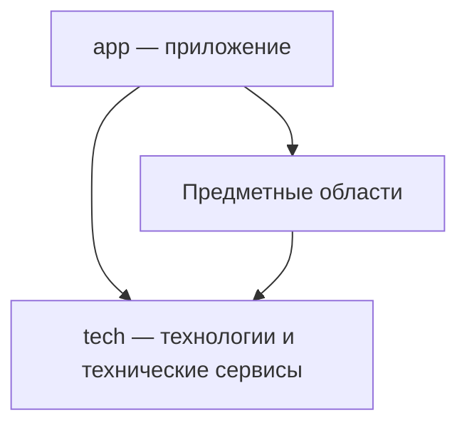

# Архитектура Repo

Repo является корневым пакетом репозитория с собственной Git-историей.
Он определяет предметную область, состав частей, принадлежность и направление
зависимостей. Метод проектирования раскрывается [отдельно](./design.md).

Repo может участвовать в разных Project, сохраняя идентичность и историю.
Workspaces объявляет только Repo: корневые glob охватывают его пакеты.
Вложенные пакеты не повторяют эти объявления.

## Области репозитория

На верхнем уровне Repo находятся технологии, необязательное приложение
и самостоятельные предметные области. Их конкретный состав определяется
назначением проекта.

```text
repo/
├── tech/
├── app/          при наличии собственного приложения
├── subject-a/
└── subject-b/
```

### Технологии

`tech` владеет всей технологической частью: настройкой, инициализацией,
жизненным циклом, вспомогательными сущностями, контрактами и объединением
технологий в сервисы. Здесь находятся технические возможности работы
с базами данных, транспортами, серверами и другими средствами реализации.

Технический сервис может соединять несколько технологий. Его состав
и поведение остаются технологическими: `tech` не использует предметные
сущности приложения и не зависит от `app`.
Вспомогательные сущности внутри `tech` выражают технические обязанности
и не принимают на себя предметные правила приложения.

### Предметные области

Предметная сущность определяется смыслом системы. Это может быть репозиторий,
сценарий, чат, узел графа или понятие языка. Термин применим и к приложениям,
и к техническим библиотекам.

Предметные области владеют правилами, контрактами и реализацией своих
возможностей. Они используют `tech`, максимально подготавливая эти возможности
к использованию в `app`: предметная работа с технологиями реализуется
у самой сущности. Приложение соединяет готовые публичные возможности.

### Приложение

`app` использует технологии и подготовленные предметные возможности:
выбирает нужные части, соединяет их и организует работу конкретного приложения.
Композиция предметных сущностей принадлежит приложению. Композиция одних
только технологий может оставаться техническим сервисом в `tech`.

`app` может отсутствовать полностью. Репозиторий в таком случае предоставляет
возможности другим приложениям. Пустой каталог или искусственная точка сборки
ради формы не создаются.


## Принадлежность и участие

Сущность, имеющая единственного предметного родителя, размещается внутри
его области. Сущность, которая может принадлежать нескольким предметным
родителям, получает самостоятельную область на верхнем уровне Repo.
Внутри неё находятся компоненты или домены, выражающие её участие
в соответствующих родителях и названные по этим родителям.

Такая вложенная часть представляет участие конкретной сущности в родителе.
Она не копирует всего родителя или общую реализацию сущности. Использование
через импорт само по себе не передаёт принадлежность; одинаковое имя
не устанавливает тождество разных предметов.

Участие сущности в технологии выражается её компонентом или доменом
с именем соответствующей технологии из `tech`. Имя показывает связь,
а контракт и реализация раскрывают конкретную ответственность.
Общий технологический код сохраняет своего владельца.

Повторное использование не образует отдельной области исходников.
Частные помощники находятся в `src` своего пакета; самостоятельная возможность
для нескольких пакетов получает предметного или технического владельца
и публичный API. Границы импортов проверяются в разделе «Границы зависимостей»
[сценария Package](../../package/reader/spec/scenario.spec.ts).

Например, `tech/database` предоставляет техническую работу с базой данных,
а `chat/database` реализует хранение чатов. `tech/acp` подключает исполнителя,
а `chat/session` владеет сеансом беседы. `app` связывает готовые возможности
с окружением и собирает приложение.
Это пример распределения ответственности; состав сущностей Storybook
ещё предстоит определить.


## Направление зависимостей

Стрелки означают использование публичной возможности, а не вложенность
директорий или порядок запуска.



- `app` использует предметные области и `tech`.
- Предметные области используют `tech` и публичные возможности других
  предметных областей; от `app` они не зависят.
- `tech` использует технологии и их технические контракты;
  предметные области и `app` ему неизвестны.

Направление зависимости сохраняется при разделении реализации на несколько
модулей: промежуточная обёртка не должна скрывать обратную зависимость.
Вложенность исходников сама по себе не объединяет состояния, процессы
или жизненные циклы разных реализаций.


## Применение стиля

Стиль задаёт устройство ответственности и зависимостей. Архитектура
конкретного проекта определяет сами сущности, компоненты, технологии
и отношения между ними. [Методика проектирования](../../project/src/architecture.md)
описывает, как выявлять эти части, устанавливать принадлежность и проверять
границы. Общий ход принадлежит Project; [проектирование Repo](./design.md) раскрывает
принадлежность частей, форму и разделение подготовки и исполнения.

Самостоятельные части оформляются по
[структурному стандарту Package и архетипов](../../package/src/architecture.md).
Он определяет границы Component, Container, Domain и Cluster.
Средовые реализации одной сущности и группа самостоятельных участников общего
протокола получают разные основания; один состав вложенных пакетов их не различает.
[Состояние перехода](../../package/meta/notes/archetype-transition.md) связывает определения
с действующими читателями, сценариями, выдачей через MCP и продолжающейся
миграцией конкретных владельцев.
Предметная сущность здесь обозначает смысл, а не дополнительный структурный
класс или поле манифеста.
