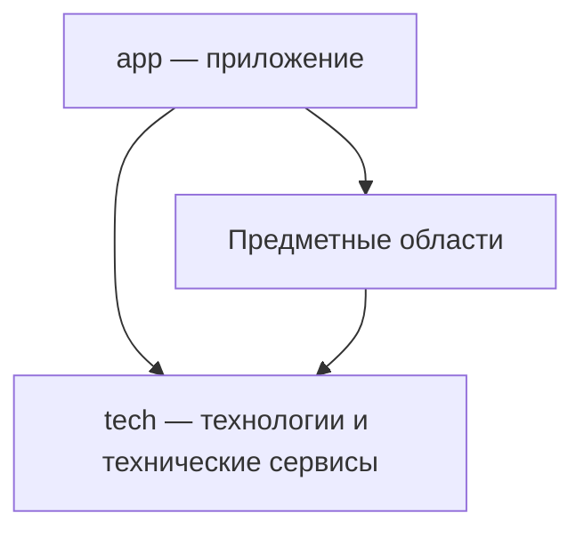

# Архитектура Repo — Направление зависимостей

Стрелки означают использование публичной возможности, а не вложенность
директорий или порядок запуска.

- `app` использует предметные области и `tech`.
- Предметные области используют `tech` и публичные возможности других
  предметных областей; от `app` они не зависят.
- `tech` использует технологии и их технические контракты;
  предметные области и `app` ему неизвестны.

Направление зависимости сохраняется при разделении реализации на несколько
модулей: промежуточная обёртка не должна скрывать обратную зависимость.
Вложенность исходников сама по себе не объединяет состояния, процессы
или жизненные циклы разных реализаций.
