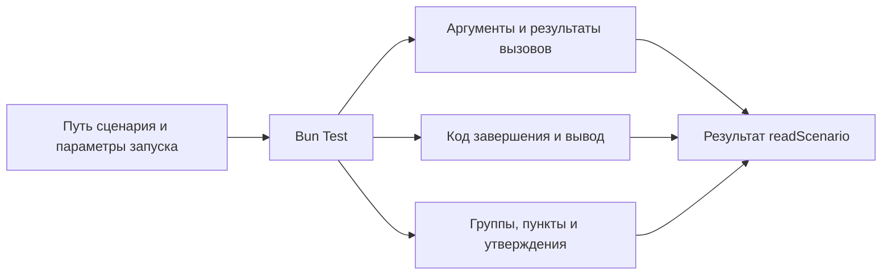

# Как получить данные выполненного сценария

[readScenario](../../index.ts) читает структуру исходника, выполняет его настоящим
Bun Test и применяет правила архетипа. Результат содержит source со структурой
и фрагментами кода, данные одного выполнения и validation с результатами проверок.
К данным выполнения относятся путь, код завершения, оба потока вывода, история
вызовов, группы, пункты, утверждения и исходный JUnit этого же запуска.
Аргументы задаёт [контракт читателя](../../contract/index.ts).

Это полные данные наблюдаемого выполнения для валидации, приложения
и [подготовленного представления сценариев](../../../../presentation/meta/notes/presentation.md).
Публичный [HTTP-вход MCP](../../../../../app/knowledge/README.md) раскрывает исходники сценариев
и схемы контрактов выбранного владельца, а не этот технический отчёт.
Общие объекты внутри снимка сохраняются один раз и связаны ссылками;
точная семантика описана в [формате данных инспектора](./value-format.md).



## Валидация

validation.checks содержит правило, его состояние и обнаруженные нарушения
с координатами исходника. passed означает прохождение реализованной проверки,
failed — найденные нарушения, not-checked — отсутствие достаточной проверки.
Общий статус incomplete сохраняет видимость незавершённых требований, даже если
все реализованные проверки прошли.

Проверяются нативные импорты, расположение файла, внешняя параметризация,
явная регистрация, размещение описаний, импорты mock/spyOn, пояснения пропусков,
наличие expect и исход Bun. Наблюдаемые вызовы вне test подтверждают только
наличие подготовки, а не полный поток данных. Публичность импортов, границы
фикстур, поток данных, освобождение всех ресурсов и смысловая полнота остаются
not-checked.

Нарушения оформления не уничтожают данные завершённого запуска. Ошибки чтения,
запуска и получения отчёта по-прежнему прерывают readScenario исключением.
Сценарий-руководство получает структуру и валидацию через тот же публичный вызов;
production-код не импортирует его фикстуры.

## Что передаёт вызывающий код

Обязателен путь к файлу. Необязательные props заменяют одноимённые поля props
каждой строки внешнего describe.each; остальные поля строки сохраняются.
Вложенный объект или массив заменяется целиком. Вложенные describe.each
и test.each сохраняют собственные параметры. Например:

```ts
await readScenario({
  path: "/проект/package/spec/scenario.spec.ts",
  props: {path: "/проект/app"},
  testNamePattern: "Корневой пакет",
})
```

Внешний path выбирает файл теста, props.path — объект его проверки.
Параметры передаются дочернему процессу через stdin до загрузки сценария.
Допустимы JSON-данные; функции, undefined, циклы и специальные объекты
отклоняются до запуска, без потери значений при сериализации.
Сам файл и объявленная таблица не изменяются; следующий обычный запуск
использует исходные данные. Импорт сценария остаётся обычным bun:test.

Для публичного default-класса вариант содержит один прямой `new` в подготовке.
Читатель связывает его с наблюдённым конструированием того же запуска и показывает
исход без повторного создания экземпляра. Два конструирования в одном варианте
нарушают правило единственного вызова и не дают preview.

Вызываемость публичного default определяется сигнатурами его экспортируемого типа.
Функция с добавленными через `Object.assign` статическими полями получает preview
по одному наблюдённому прямому вызову; подготовка представления не вызывает её
повторно. Объектный default без сигнатуры вызова или конструирования остаётся
структурным описанием без исполняемого function preview.

testNamePattern выбирает тесты штатным фильтром Bun. Подготовка внутри describe
может выполняться и у вариантов, тесты которых отфильтрованы.

Для запуска одной строки передаётся `variant` — её индекс с нуля в единственном
внешнем describe.each. Остальные строки не регистрируются и не выполняют
подготовку. `props` применяются только к выбранной строке. `signal` отменяет
дочерний процесс и отклоняет чтение, не возвращая старый результат.

`onProgress` сообщает этапы подготовки, выполнения и формирования результата,
а также фрагменты stdout/stderr дочернего Bun сразу после их получения.
Потоки декодируются последовательно, без потери символов UTF-8 на границах чанков.
Это наблюдение не заменяет итоговый отчёт и не определяет статусы тестов по тексту.

Публичные экспорты читателя определены в [index.ts](../../index.ts).
Типы частей результата выводятся из выходного контракта в [src/types.ts](../../src/types.ts).
Archetypes использует этот читатель для [readScenarioGuide](../../../index.ts),
который возвращает руководство по написанию, а не полный технический отчёт.

При вызове из другого пакета file-зависимость может разрешаться в установленную
копию исходников. После изменения инспектора обновляется именно эта зависимость;
совпадение версии package.json не доказывает совпадение кода. Проверять нужно
публичный импорт потребителя, а не подменять его прямым путём во внутренний src.
Перезапуск MCP-прокси не обновляет установленную копию пакета.

## Как определяется среда

Сборщик читает импорты исполняемого кода и ближайший package.json.
Рабочей директорией становится директория этого пакета.
Preload берётся из bunfig.toml и подходящей команды bun test в scripts.test.
Поддержаны явные пути и директории; shell-команды, glob и подстановки shell
не исполняются. JSX transport определяется по публичному jsx-runtime export
пакета preload. Неоднозначная конфигурация даёт ошибку.

## Что можно наблюдать

Автоматически наблюдаются функции импортированных прикладных модулей
и собственные изменяемые методы возвращённых объектов.
Встроенные модули Bun и Node исключены. Обёртки сохраняют this и Promise;
исходники сценария и компонента на диске не меняются.

Immutable методы, constructors, динамические импорты и скрытое состояние
native объектов пока не поддержаны. Детали подготовки среды находятся
в [discover](../../src/discover.ts), запуск и получение отчёта —
в [trace](../../src/trace.ts).

## Дочерние компоненты в предпросмотре

Авторский сценарий передаёт JSX описываемого компонента непосредственно
в единственный аргумент `render`. Фикстура подготавливает данные и среду.
Строка `describe.each` хранит свойства в `props`, а содержимое именованных
и безымянного слотов — в отдельном `slots`; JSX внутри парных тегов компонента
передаёт объявленные слоты, например `slots.header` и `slots.default`.
Точная форма раскрыта в [руководстве сценариев](../../../spec/scenario.spec.ts).

JSON-поля остаются в `preview.variants[].props`. Содержимое слотов сохраняется
в `slots` как исходный JSX и точные импорты; внутренний transport также сохраняет
JSX-значения свойств в `jsxProps`. Подготовка и JSX компилируются в модуль той же
ревизии, без импорта Bun Test в браузер. Повторный запуск передаёт только
JSON-props и исполняет исходный JSX выбранной строки. При успешном отчёте host
обновляет прежний экземпляр компонента. Editor показывает импорт
и JSX компонента владельца с содержимым слотов.

## Вложенная параметризация

Один внешний `describe.each` задаёт варианты общего содержания, вложенный
`describe.each` — собственные варианты следующего уровня. Подготовка перед
проверками конечного варианта содержит единственный `render(<Component … />)`.
Внутренняя строка может составлять props через spread внешних props;
содержимое слотов собирается из исходных строк выбранной ветки.

Preview сохраняет исходные названия в `path` и индексы таблиц в `selection`.
Inspector показывает дерево describe. `variantPath: [1, 2]` выполняет только
выбранную ветку; JSON-props заменяются в последней выбранной таблице,
а JSX восстанавливается из её исходных предков. `test.each` не входит в путь.
Обычный `variant` сохраняет прежний выбор строки внешней таблицы.
