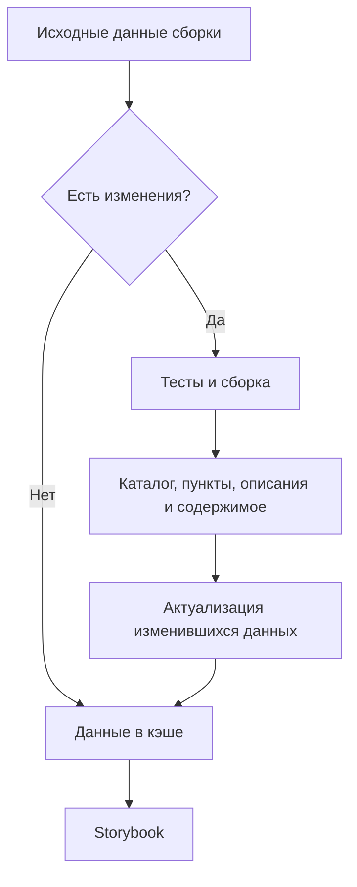

# Сборка и кэширование данных сценариев

Каталог вариантов, пункты, их описания и содержимое собираются из выполняемых
тестов во время сборки Storybook. Собранные данные сохраняются в кэше
и используются интерфейсом. Открытие пункта показывает подготовленные данные.
Источник текущего навигационного ответа MCP описан отдельно у
[HTTP-входа MCP](../../../../app/mcp/rest/README.md).

Если исходные данные сборки не изменились, используется кэшированный результат.
При изменениях выполняются тесты и сборка; после выполнения тестов полученные
данные актуализируются, если их содержимое изменилось.

[Сборщик](../../../../package/build/prepare/index.ts) сохраняет полный отчёт каждого сценария
в неизменяемой ревизии. [Сервер запуска](../../../../app/server/src/scenario-run.ts) выбирает
из него проверки варианта и его вложенных тем. Совпадающие props используют этот
результат без нового Bun Test, в том числе при первом открытии и из другой вкладки.

Результат связан с отображаемой ревизией. Пока HMR готовит следующую, предыдущая
рабочая ревизия сохраняет собственные код и проверенные данные. Ошибка новой
сборки не делает её результатом предыдущей. Новая ревизия получает новый отчёт.

Изменённые props и явный повтор запускают тест против подтверждённых входов
этой ревизии. Сервер сверяет существующий fingerprint до и после выполнения;
изменение исходников, зависимостей, ресурсов или конфигурации во время прогона
не превращается в актуальный результат. Неуспешный завершённый тест сохраняется,
а отменённый, неполный или не запустившийся прогон повторно не используется.

Одинаковые запросы разделяют одно выполнение. Отмена читателя прекращает его
ожидание, сохраняя общий прогон для других читателей и последующего выбора.
Сервер удерживает не более 64 дополнительных прогонов; его остановка отменяет
работу и освобождает результаты. Отчёт сборки остаётся неизменяемым.
Представление результата функции принадлежит Web.

Технический отчёт описан у [читателя Specs](../README.md). Руководство
использует готовые данные для [применения правил написания](../../README.md).
